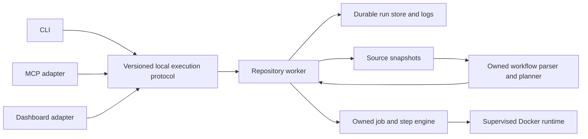

# Rookrunner — technical design

Status: proposed target architecture. The completed M1 worker/CLI implements
durable synthetic development runs. See the [implemented contract](development-contract.md)
for its narrower behavior and limits. Owning the workflow engine is now accepted
direction; the detailed component design below remains proposed.

## Components

The worker owns run state and process supervision. Clients can disconnect without stopping jobs.
MCP remains a client adapter; its transport lifecycle does not own execution.
The dashboard uses the same worker contract and does not write the run store directly.

One worker serves one explicitly configured repository in the first release.
An initial default concurrency of one limits interference. This is not a distributed scheduler.

## Execution boundary

The owned engine exposes capability discovery, planning, execution, cancellation,
and cleanup evidence. It reports structured step/job events to the worker rather
than writing protocol responses directly. Rookrunner owns workflow semantics,
expression evaluation, action runtimes, scheduling, and resource supervision;
it does not invoke act or silently delegate unsupported workflows to another engine.
See the [engine design and compatibility plan](execution-engine.md).

Keep backend selection explicit. Do not silently fall back to host shell execution or another engine.
Record the engine version, effective runner image digest, configuration digest, and compatibility notes with every run.
An engine returning zero establishes its result under the recorded compatibility limits, not complete GitHub Actions equivalence.

## Source capture

Before accepting a run, build a worker-owned snapshot from the submitted repository.
Capture tracked working files, deletions, executable modes, symlinks, and explicitly included untracked inputs.
Exclude execution state and known credential files. Gitignore rules alone are not a secret detector.
Reject unsupported submodule, LFS, or external symlink cases with clear errors until their capture behavior is defined.

Detect changes during capture and retry or reject an unstable input set.
Compute a manifest digest and workflow digest. Record the base commit and dirty state where available.
The accepted run refers to the snapshot, never to the mutable original checkout.

Preserve repository metadata needed by supported workflows without copying credentials from local Git configuration.
Validate checkout actions and Git-dependent workflows against this capture strategy before declaring them supported.
The allow-list is [sanitized Git metadata](git-metadata.md) and is copied to `git.json`. An owned checkout accepts `uses: actions/checkout@v4` and does not replace those files ([checkout](checkout.md)). Other checkout actions stay rejected. The trees and blobs of the captured base commit are stored beside the manifest ([git objects](git-objects.md)). The original commit object stays excluded. One synthesized commit for that tree is stored ([synthesized commit](synthesized-commit.md)). When the object store is present, the attempt workspace receives an owned `.git` directory ([Git directory](git-directory.md)). An absent store still has no `.git`. The `check.yml` dogfood path is designed and is not implemented ([dogfood check](dogfood-check.md)).

## Durable ownership

Proposed persistence: SQLite for run metadata and idempotency keys, with files for snapshots and output.
Use transactional state changes and one worker lock per repository/state directory.
Write and finalize snapshot files before committing an accepted queue entry.
Recover abandoned preparation files separately; an incomplete snapshot must never enter the executable queue.

Persist a run ID and submission key before acknowledging acceptance.
Write an attempt record before launching a process. Tag owned processes and containers with attempt identity.
After restart, reconcile interrupted attempts before accepting new execution that could overlap them.
An unresolved attempt becomes lost. It requires explicit resubmission after cleanup, not an automatic retry.

Retention must preserve active attempts and their evidence. Disk exhaustion must stop new submissions with a useful error.
The default budget is GitHub Actions cache storage, 10 GB per repository (https://docs.github.com/en/actions/reference/limits), stored as 10 * 1024 * 1024 * 1024 bytes. It covers state, snapshots, and attempt workspaces. It refuses new submissions and does not evict active evidence. Runs and keys are retained indefinitely.

## Cancellation

For queued work, persist cancelled and remove its scheduling eligibility.
For active work, request termination, wait a bounded grace period, and escalate if necessary.
Confirm termination of the backend and its owned containers before reporting cancelled.
If cleanup cannot be established, record lost with cleanup details and block conflicting execution.

The worker serializes competing completion and cancellation updates. The first committed terminal result remains authoritative.
Rerunning work creates a new run with a parent reference; it does not rewrite history.

## Local access

Create a Unix socket accessible only to its owning user. Use restrictive permissions for the state directory.
Validate repository identity and constrain artifact paths to worker-owned storage.
Bound request size, log response size, and queue growth.
Keep secrets out of request envelopes, snapshots, logs written by the supervisor, and result metadata.
Workflow-generated output can contain sensitive data; do not promise universal log redaction.

The initial worker exposes no network listener. Remote execution requires authentication, leases, transport security, and a separate threat model.
Serving unrelated customers also requires stronger execution isolation than the local Docker trust model.

## Packaging and migration

Build a release that operates outside this source checkout. Include declared prerequisites and backend provenance.
Check third-party notices and redistribution terms for every bundled component.
Resolve runtime dependencies and runner images through explicit configuration or
packaged resources, never another project's checkout. Owning engine semantics
does not remove third-party provenance and license obligations.

Local Actions remains a reference for behavior and implementation tradeoffs.
Existing Local Actions services, sockets, state, and command names are outside this repository's migration scope.
Any future state import must be explicit and versioned.

## Future extension points

The protocol uses run identities and artifact references rather than assuming clients can open worker filesystem paths.
A later remote coordinator could dispatch captured inputs to authenticated workers.
GitHub-dispatched jobs could use an official runner adapter with separate lifecycle requirements.
Neither extension is required to deliver the initial local worker.
