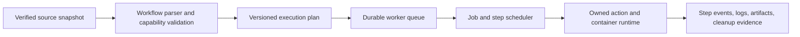

# Owned workflow engine and compatibility plan

Status: owned-engine direction accepted in [decision 0003](../decisions/0003-owned-execution-engine.md).
The component decomposition and sequence below are proposed implementation details.
Parsing, snapshot verification, attempt materialization, the first Bash
subset, version 1 execution of one accepted job, paging of that job's
step stdout and stderr, the job and step timeout bounds, and caller
cancellation of a running container are implemented. If that cleanup cannot
be shown, the run is lost and a new workflow attempt is refused until this
process restarts. Restart removes a container left by a killed worker, or
records that attempt unresolved and does not run it again. A queued workflow
can still start. An unresolved attempt blocks reuse of its container or
workspace identity. A configured disk budget refuses a new submission that
would exceed it. The default is 10 GB per repository of GitHub Actions cache
storage (https://docs.github.com/en/actions/reference/limits), stored as
10 * 1024 * 1024 * 1024 bytes. Active runs and their evidence are kept.
A finished workflow attempt publishes a manifest of the regular files it
wrote under its workspace. `run.artifacts` and `artifact.read` page that
manifest and its bytes. A step `if` on the Bash subset is evaluated by an
owned parser. Other expression positions stay literal. `hashFiles`, job
`if`, `needs`, and `secrets` stay unsupported.
The rest of this plan is not.

## Execution path

The parser consumes the captured workflow, not a later checkout version. It
validates the entire submitted workflow under an explicit selection policy before
acceptance. A selected job must include its required dependency closure once
dependencies are supported. Job selection must never silently omit required work.

An execution plan records workflow/source identities, engine and capability
versions, normalized jobs/steps, event context, environment/shell defaults, image
identities, and limits. Worker acceptance transactionally binds that plan to its
snapshot and idempotency key. Evaluation that depends on prior step outputs occurs
at runtime through the owned expression engine, not by reevaluating mutable inputs.

The runtime owns attempt workspaces, container/process identities, and lifecycle
operations directly. It emits structured events to the worker rather than parsing
another workflow engine's console output. Persist ownership before launch; reconcile
interrupted ownership before accepting conflicting execution. Use disposable test
environments for real execution checks, and never mount the Docker socket or host
credentials into ordinary job containers by default.

## M2 implementation order

1. **Parse and plan:** choose a maintained YAML parser after provenance review;
   reject duplicate keys, ambiguous unsupported constructs, and unsupported fields.
   Preserve string keys such as `on`, source locations, and expression text.
   Produce a deterministic plan and precise errors without launching work.
2. **Execute the first subset:** verify snapshot content, create a separate attempt
   workspace, and run sequential Linux Bash steps in a digest-identified Docker
   environment. Implement documented shell/default/env/working-directory behavior
   for that subset rather than approximating it silently. Initial local event input
   is explicit; it is not GitHub event delivery.
3. **Supervise durably:** capture-before-acceptance workflow RPC, per-step records,
   bounded logs/artifacts, timeout and cancellation, process/container cleanup,
   crash reconciliation, and disk budgets. Preserve M1 v0 development behavior.
4. **Establish conformance:** paired success/failure/defaults fixtures and captured
   source checks. Compare semantic outcomes and relevant emitted values, not wall
   time or incidental log formatting. Record environment-related differences.

Do not advertise expression positions other than step `if`, or `uses`,
dependencies, matrices, services, or reusable workflows, while building this
path. Early rejection is temporary capability status, not a decision to
abandon those features.

## Compatibility expansion

| Area | Planned behavior and evidence | Initial status |
| --- | --- | --- |
| Workflow parsing | Actions YAML shape, meaningful diagnostics, bounded parsing, deterministic plans | Implemented for one selected job of sequential `run` steps |
| Steps and shells | Ordering, script invocation, defaults, environment precedence, working directories | Implemented for the Linux Bash subset in one caller-pinned container |
| Conditions and expressions | Own parser/evaluator; types, coercion, contexts, functions, status checks; never Python `eval` | Implemented for step `if` on the Bash subset. Other expression positions stay literal. Not a GitHub-equivalence claim |
| Job dependencies | `needs`, outputs, failure/skip propagation, selected dependency closure | Not implemented |
| Runtime communication | `GITHUB_ENV`, `GITHUB_OUTPUT`, `GITHUB_PATH`, state files, workflow commands and masking | Not implemented |
| Action types | Composite, JavaScript, and Docker actions; inputs/outputs; setup/main/post lifecycle | Not implemented |
| Strategies | Matrix expansion, include/exclude, fail-fast, max-parallel, concurrency | Not implemented |
| Reuse | Reusable workflows, typed inputs, outputs, nesting, explicit secret handling | Not implemented |
| Repository behavior | Sanitized Git metadata and checkout semantics consistent with identified source | Capture exists; Git/checkout execution unsupported |
| Services and artifacts | Owned service containers, readiness, cache/artifact interfaces and cleanup | Not implemented |
| Hosted capabilities | Token permissions, OIDC, environments/approvals, event delivery, runner labels/images | Requires explicit integration; no local equivalence claim |
| Platforms | Linux first, then separately validated shell/OS/architecture implementations | No real workflow platform validated |

The order after the initial M2 path is provisional; compatibility findings and
real project workflows should determine priority. Secrets remain disabled until
an explicit provisioning and isolation design is implemented.

## Conformance evidence

For each capability, retain its reference documentation, fixture workflow, explicit
inputs, expected outputs/conclusions, local evidence, and any GitHub reference run
identity with runner/action versions. Reference runs are a future validation step;
none have been dispatched or inferred from local tests. Publishing a fixture or
dispatching GitHub Actions is a separate external action requiring authorization.

A locally validated feature remains labeled as such until a reference comparison
exists. Document intentional local differences and reject workflows that require
unavailable hosted capabilities. A workflow passing locally establishes the result
under the recorded capability set, not universal GitHub equivalence.

## Specification references

Reviewed 2026-09-23; references are moving documentation, so each conformance record
must record the behavior/date it was built against:

- [GitHub workflow syntax](https://docs.github.com/en/actions/reference/workflows-and-actions/workflow-syntax)
- [Expressions](https://docs.github.com/en/actions/reference/workflows-and-actions/expressions)
- [Workflow commands and environment files](https://docs.github.com/en/actions/reference/workflows-and-actions/workflow-commands)
- [Action metadata and runtimes](https://docs.github.com/en/actions/reference/workflows-and-actions/metadata-syntax)

These are behavioral references. No upstream engine source or binaries have been
copied. Source provenance and licenses must be reviewed before any later import.

A proposed survey of open-source runners, and the requirement tiers that survey
implies, is in
[actions runner requirements](../research/actions-runner-requirements.md).
That note is research. It is not accepted scope.
