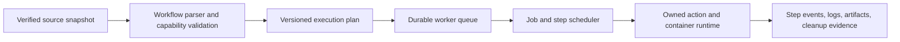

# Owned workflow engine and compatibility plan

Status: owned-engine direction accepted in [decision 0003](../decisions/0003-owned-execution-engine.md).
The component decomposition and sequence below are proposed implementation details.
Parsing, snapshot verification, attempt materialization, the first Bash
subset, version 1 execution of one accepted job, paging of that job's
step stdout and stderr, the job and step timeout bounds, and caller
cancellation of a running container are implemented. If that cleanup cannot
be shown, the run is lost and a new workflow attempt is refused until this
process restarts. Restart removes a container left by a killed worker, or
records that attempt unresolved and does not run it again. A queued workflow
can still start. An unresolved attempt blocks reuse of its container or
workspace identity. A configured disk budget refuses a new submission that
would exceed it. The default is 10 GB per repository of GitHub Actions cache
storage (https://docs.github.com/en/actions/reference/limits), stored as
10 * 1024 * 1024 * 1024 bytes. Active runs and their evidence are kept.
A finished workflow attempt publishes a manifest of the regular files it
wrote under its workspace. `run.artifacts` and `artifact.read` page that
manifest and its bytes. NS-46 names selected files in that
manifest, including a local CodeQL SARIF file. Unselected differing
files stay unnamed. P4 designs major-tag checkout and `fetch-depth: 0`
and does not implement them. A step `if`, a job `if`, and job outputs are
evaluated by an owned parser. `GITHUB_ENV`, `GITHUB_OUTPUT`, `GITHUB_PATH`,
and stdout workflow commands apply to later steps in the same job. The
selected job runs after the jobs it needs, one at a time, in one
caller-pinned container and one attempt workspace. Workflow `run`, `env`,
`with`, and step and job `name` are evaluated, including mixed text.
A concurrency group on a workflow or the selected job is enforced on
this one worker when the run is accepted. Group names are case
insensitive. `queue: single` replaces another queued run in that group.
`cancel-in-progress` also cancels the running run. `queue: max` keeps
at most 100 pending runs in the group. This is not a distributed lock.
Local composite actions with `run` steps are read from
the snapshot. A literal job matrix is expanded. A local reusable
workflow is called from that snapshot. `hashFiles`, matrix expressions,
`node20`, `pre`, and Docker actions, remote reusable workflows,
and a secret store stay unsupported. A remote `node24` `main` runs from
a copy in the attempt, and its `post` runs after the job's main steps.
This is not a GitHub-equivalence claim.
The rest of this plan is not.

## Execution path

The parser consumes the captured workflow, not a later checkout version. It
validates the entire submitted workflow under an explicit selection policy before
acceptance. A selected job includes its required dependency closure. Job
selection must never silently omit required work.

An execution plan records workflow/source identities, engine and capability
versions, normalized jobs/steps, event context, environment/shell defaults, image
identities, and limits. Worker acceptance transactionally binds that plan to its
snapshot and idempotency key. Evaluation that depends on prior step outputs occurs
at runtime through the owned expression engine, not by reevaluating mutable inputs.

The runtime owns attempt workspaces, container/process identities, and lifecycle
operations directly. It emits structured events to the worker rather than parsing
another workflow engine's console output. Persist ownership before launch; reconcile
interrupted ownership before accepting conflicting execution. Use disposable test
environments for real execution checks, and do not mount the Docker socket
or host credentials into ordinary job containers unless the worker was
started with `--docker-socket`. That flag exposes the host Docker service
to the job. The job keeps the caller user. When the socket is mounted, a
private Docker volume is mounted into the job at that volume's
mountpoint, and `TMPDIR`, `TEMP`, and `TMP` default to it. A later env
layer can replace those three. The volume is removed with the job
container. The host `/tmp` is not mounted. Host credentials stay
unmounted.

## M2 implementation order

1. **Parse and plan:** choose a maintained YAML parser after provenance review;
   reject duplicate keys, ambiguous unsupported constructs, and unsupported fields.
   Preserve string keys such as `on`, source locations, and expression text.
   Produce a deterministic plan and precise errors without launching work.
2. **Execute the first subset:** verify snapshot content, create a separate attempt
   workspace, and run sequential Linux Bash steps in a digest-identified Docker
   environment. Implement documented shell/default/env/working-directory behavior
   for that subset rather than approximating it silently. Initial local event input
   is explicit; it is not GitHub event delivery.
3. **Supervise durably:** capture-before-acceptance workflow RPC, per-step records,
   bounded logs/artifacts, timeout and cancellation, process/container cleanup,
   crash reconciliation, and disk budgets. Preserve M1 v0 development behavior.
4. **Establish conformance:** paired success/failure/defaults fixtures and captured
   source checks. Compare semantic outcomes and relevant emitted values, not wall
   time or incidental log formatting. Record environment-related differences.

Do not advertise expression positions other than step `if`, job `if`, job
outputs, workflow `env`, job `env`, step `env`, step and composite `run`,
step and job `name`, the calling step's `with` including mixed text,
whole-string action output `value`, and `workflow_call` input, default,
and output expressions. Workflow `name`, service `env`, `working-directory`,
and matrix expressions stay literal. Do not advertise JavaScript actions, Docker
actions, remote `uses`, or matrix expressions. Service containers are a
digest-pinned subset and are not a describe capability. Local reusable
workflows are called from the snapshot. Early rejection is temporary capability
status, not a decision to abandon those features.

## Compatibility expansion

| Area | Planned behavior and evidence | Initial status |
| --- | --- | --- |
| Workflow parsing | Actions YAML shape, meaningful diagnostics, bounded parsing, deterministic plans | Implemented for one selected job of sequential `run` steps, plus local composite `uses` expanded from the snapshot |
| Steps and shells | Ordering, script invocation, defaults, environment precedence, working directories | Implemented for the Linux Bash subset in one caller-pinned container. Process env is workflow, job, earlier `GITHUB_ENV`, then step env. Not a GitHub-equivalence claim |
| Conditions and expressions | Own parser/evaluator; types, coercion, contexts, functions, status checks; never Python `eval` | Implemented for step `if`, job `if`, job output expressions, and expressions in `run`, `env`, `with`, and step and job `name`, including mixed text. `secrets` stays unavailable. `hashFiles` is not implemented. `case` matches the expression reference and does not evaluate a branch it does not take. `env.MY-VAR` is the property `MY-VAR`, not subtraction. Not a GitHub-equivalence claim |
| Job dependencies | `needs`, outputs, failure/skip propagation, selected dependency closure | Implemented for the selected job's `needs` closure. Jobs run one at a time in one container and one workspace. A dependency outside the workflow fails planning. An output expression that reads `secrets` is omitted. Not a GitHub-equivalence claim |
| Runtime communication | `GITHUB_ENV`, `GITHUB_OUTPUT`, `GITHUB_PATH`, state files, workflow commands and masking | Implemented for the three files and documented stdout commands, including `add-mask`, for later steps in the same job. `set-env` and `add-path` are disabled. State files and job summaries are not. Not a GitHub-equivalence claim |
| Action types | Composite, JavaScript, and Docker actions; inputs/outputs; setup/main/post lifecycle | Implemented for local composite actions whose steps are `run` steps, loaded from the snapshot (`./` and `$/`). A remote action pinned by 40 lowercase hexadecimal characters is fetched with Git and no credential into a content-addressed store. The plan records the owner, repository, path, commit, and content digest. A remote composite's `run` steps execute from that plan. A remote `node24` action with `main` is copied into the attempt and mounted read-write at `/actions/{owner}/{repo}/{sha}`. The store is not mounted. `/opt/node24/bin/node` runs `main` with working directory `/workspace`. `post` runs the same way after the job's main steps, in reverse order, when that main ran. An omitted `post-if` is `always()`. The post receives that action's inputs and `STATE_<name>` from its own main. `worker --node24` mounts an operator-supplied directory read-only at `/opt/node24`. That directory is not on `PATH`. `pre`, `node20`, and Docker actions are not implemented. Nested `uses` is not implemented. The capability version stays 12. A version 11 plan is not migrated. Not a GitHub-equivalence claim |
| Strategies | Matrix expansion, include/exclude, fail-fast, max-parallel, concurrency | Implemented for a literal matrix. Include, exclude, fail-fast, and max-parallel follow the workflow syntax page. A matrix over 256 jobs is rejected. Combinations run one at a time in the one caller-pinned container. Matrix expressions and `continue-on-error` are not implemented. Workflow `concurrency` is separate from matrix `max-parallel` and is enforced on this one worker. Not a GitHub-equivalence claim |
| Reuse | Reusable workflows, typed inputs, outputs, nesting, explicit secret handling | Implemented for a local `workflow_call` read from the snapshot (`./` and `$/`). Inputs are boolean, number, or string. Nesting stops at ten workflows. Fifty unique called workflows is the maximum. Secrets are not passed. Remote reusable workflows are not implemented. Not a GitHub-equivalence claim |
| Repository behavior | Sanitized Git metadata and checkout semantics consistent with identified source | Capture writes a sibling `git.json` with the base commit, dirty flag, object format, and a local branch name. Credentials and remote URLs are excluded. `uses: actions/checkout@v4` and a full 40-character lowercase SHA pin of `actions/checkout` are an owned checkout that does not replace those files, does not fetch or verify the SHA, and does not persist a credential. Other checkout actions stay rejected. The trees and blobs of the captured base commit are stored beside the manifest. The original commit object stays excluded. One synthesized commit for that tree is stored. When the object store is present, the attempt workspace receives an owned `.git` directory. An absent store still has no `.git`. A run sets the NS-33 `github` and `runner` properties and the default variables. `github.sha` is the manifest base commit only for a clean capture. `github.token` and `GITHUB_ACTIONS` stay unset. `check.yml` was run from the CLI. NS-38's identified commit ended `failed`. The gap that record names is closed: a later run ended `succeeded` with exit code 0. Owner CI is designed in [owner CI](owner-ci.md). NS-40 posts one commit status. NS-41 evaluates `on` for push and pull request. A tag push skips the path filters. Tags under `pull_request` are ignored. NS-42 polls one owner repository. NS-43 recorded statuses for one push and one pull request ([validation](../validation/owner-ci-rookrunner.md)). NS-44 evaluates expressions in `run`, `env`, `with`, and step and job `name`, including mixed text. NS-45 evaluates `concurrency` and `cancel-in-progress` on this one worker. With `queue: max`, at most 100 runs can be pending in a group. NS-46 names selected workspace files in the artifact manifest and records one local CodeQL SARIF file ([upload artifact](upload-artifact.md)). The capability version stays 12. P4 designs an owned checkout for major tags and for `fetch-depth: 0` ([checkout tag](checkout-tag.md)). The engine is unchanged. The implementation follows that design. The rest of the provisional list is not numbered yet. |
| Services and artifacts | Owned service containers, readiness, cache/artifact interfaces and cleanup | Service containers are implemented for a digest-pinned image, env, command, and entrypoint. The service joins an owned user-defined bridge network and is removed on completion, cancel, and restart. It does not receive the engine socket. `credentials`, `volumes`, `options`, and `ports` are not implemented. Cache beyond the existing artifact manifest is not implemented. NS-46 names selected files in that manifest, including files that match the snapshot. Unselected differing files stay unnamed. Not a GitHub-equivalence claim |
| Hosted capabilities | Token permissions, OIDC, environments/approvals, event delivery, runner labels/images | Read-only `permissions` are recorded on the plan and grant no token. `write`, `write-all`, and an unknown scope are rejected. `GITHUB_TOKEN`, OIDC, environments, approvals, event delivery, and runner labels are not implemented. Not a GitHub-equivalence claim |
| Platforms | Linux first, then separately validated shell/OS/architecture implementations | No real workflow platform validated |

The order after the initial M2 path is provisional; compatibility findings and
real project workflows should determine priority. Secrets remain disabled until
an explicit provisioning and isolation design is implemented.

## Conformance evidence

For each capability, retain its reference documentation, fixture workflow, explicit
inputs, expected outputs/conclusions, local evidence, and any GitHub reference run
identity with runner/action versions. Reference runs are a future validation step;
none have been dispatched or inferred from local tests. Publishing a fixture or
dispatching GitHub Actions is a separate external action requiring authorization.

A locally validated feature remains labeled as such until a reference comparison
exists. Document intentional local differences and reject workflows that require
unavailable hosted capabilities. A workflow passing locally establishes the result
under the recorded capability set, not universal GitHub equivalence.

## Specification references

Reviewed 2026-09-23; references are moving documentation, so each conformance record
must record the behavior/date it was built against:

- [GitHub workflow syntax](https://docs.github.com/en/actions/reference/workflows-and-actions/workflow-syntax)
- [Expressions](https://docs.github.com/en/actions/reference/workflows-and-actions/expressions)
- [Workflow commands and environment files](https://docs.github.com/en/actions/reference/workflows-and-actions/workflow-commands)
- [Action metadata and runtimes](https://docs.github.com/en/actions/reference/workflows-and-actions/metadata-syntax)

These are behavioral references. No upstream engine source or binaries have been
copied. Source provenance and licenses must be reviewed before any later import.

A proposed survey of open-source runners, and the requirement tiers that survey
implies, is in
[actions runner requirements](../research/actions-runner-requirements.md).
That note is research. It is not accepted scope.
