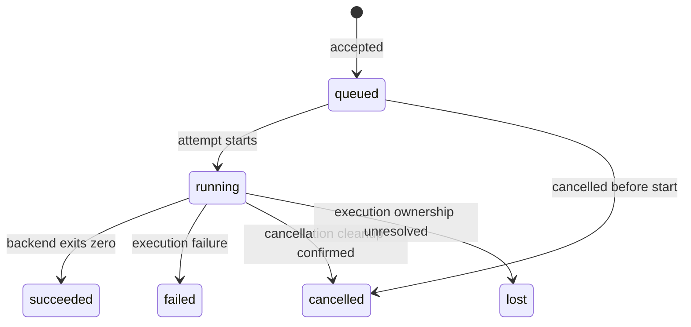

# Execution protocol — draft v0

Status: proposed workflow protocol. This broader design is not an implemented
or stable workflow wire specification.

The completed M1 v0 subset is specified separately in
[the development contract](development-contract.md) and
[machine-readable schemas](../../schemas/v0/README.md). In particular, synthetic
fixture submission does not accept the workflow/source selection proposed here.
Workflow inputs require a separately negotiated extension/version in M2.

## Transport and versioning

Proposed local transport: JSON-RPC 2.0 messages, one JSON object per line, over a Unix socket.
Request IDs correlate replies. A separate submission key prevents duplicate execution after a lost reply.
Clients begin with `worker.describe`, which advertises protocol versions, worker identity, repository identity, and capabilities.
Mutating requests carry an explicit protocol version; unsupported versions return an error before side effects.

Initial limits: 1 MiB per message and 64 KiB of decoded log data per page.
Long-running jobs never hold a submission response open for their full execution.
Poll run status and paginated logs in v0. Streaming subscriptions are deferred.

## Operations

| Method | Input | Output |
| --- | --- | --- |
| worker.describe | None | Versions, worker/root identity, capabilities, readiness, configured limits |
| run.submit | Version, submission key, workflow/job/event selection, source selection | Accepted run ID, snapshot identity, initial state |
| run.get | Run ID | Current state, attempt information, evidence, errors |
| run.list | Opaque cursor, bounded limit, optional state filter | Runs and next cursor |
| run.logs | Run ID, opaque cursor, bounded byte limit | Base64 log bytes, next cursor, end-of-stream flag |
| run.cancel | Version, run ID | Current run and cancellation-request status |
| run.artifacts | Run ID, optional cursor | Artifact manifest entries and next cursor |
| artifact.read | Artifact ID, offset, bounded byte limit | Base64 bytes, next offset, end flag |

Source and workflow paths are repository-relative. Reject escapes outside the configured repository.
Do not accept arbitrary execution commands as an undocumented escape hatch.
Base64 log and artifact payloads preserve arbitrary bytes; clients decode and render safely.
End-of-stream is final only after the writer closes, not merely when a page is temporarily empty.

## Submission semantics

Validation and source capture complete before acceptance. Invalid submissions do not create executable queue entries.
The submission key is scoped to the worker and retained with the run.
Repeating the same key and normalized request returns the same run, including its original captured inputs.
Reusing that key with different parameters returns `IDEMPOTENCY_CONFLICT`.
Clients use a new key to capture newer source, even when workflow selection is identical.

Acceptance is durable before its reply. If the connection closes first, the client retries with the same key.
Run pruning must retain key tombstones for a documented retry window; expired keys must not silently recreate old work.
The implementation milestone must define that window and its client-visible expiry behavior.

## Run state

`cancel_requested` is an independent flag while active cleanup proceeds.
Readiness or setup failure after execution starts produces failed with a structured error; exit_code may be null.
Success requires `state=succeeded` and `exit_code=0`.
Lost is terminal uncertainty, not an assertion that all execution has stopped.
Worker readiness remains false for conflicting work until unresolved ownership is reconciled.

## Run record

- Identity: run ID, worker ID, optional parent run ID, submission key.
- Selection: workflow path, job selection, event and event-payload digest.
- Source: snapshot ID and digest, workflow digest, base commit, dirty flag.
- Execution: attempt ID, backend name/version, image digest, configuration digest, compatibility notes.
- State: queued/running/succeeded/failed/cancelled/lost, cancellation flag, structured error, nullable exit code.
- Timing: acceptance, start, and finish timestamps in UTC; elapsed duration when available.
- Evidence: log availability, artifact manifest references, cleanup outcome.

Artifact entries include an ID, logical relative path, size, digest, and media type when known.
Arbitrary absolute host paths are not portable artifact identifiers.
Credentials never appear in run records. Record credential references only if that capability is added later.

## Errors

JSON-RPC reserves parse, invalid-request, unknown-method, invalid-params, and internal-error codes.
Domain errors use a server-error code with a stable `data.kind`, readable message, and retryability flag.

Initial kinds: VERSION_UNSUPPORTED, CAPABILITY_UNSUPPORTED, ROOT_MISMATCH, SOURCE_UNSTABLE,
WORKER_NOT_READY, QUEUE_FULL, RUN_NOT_FOUND, CURSOR_EXPIRED, IDEMPOTENCY_CONFLICT, STORAGE_FULL.

Transport errors must not be rewritten as successful job results.
Unknown capabilities fail explicitly. The worker must not silently ignore requested execution constraints.

## Before implementation is called compatible

Publish machine-readable schemas, valid and invalid examples, numeric error assignments, and default limits.
Define event payloads, idempotency retention, artifact retention, and snapshot rules precisely.
Verify duplicate submissions, client disconnects, log paging, malformed requests, cancellation races, and crash recovery.
Record which protocol version each released client and worker supports.
