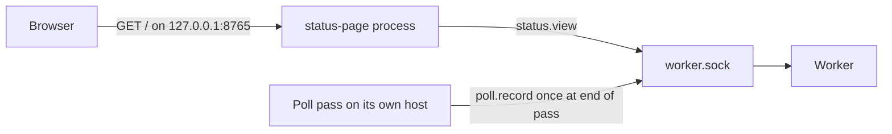
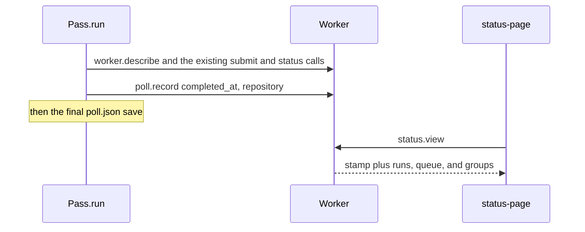

# Status page

Status: accepted, 2026-10-09. MB2090 accepted this document on
2026-10-09. `status.view` and `poll.record` are implemented. The
poll command records the last poll at the end of a pass. The page
process serves 127.0.0.1:8765.

The page this document describes is implemented. These pull
requests do not install a unit and do not start the process on
a host.

## Overview

Nexus and Vertex each run one worker. The operator on that
machine has no read-only page of the worker, the last poll, the
recent runs, or the queue. The M3 dashboard is a different
program. It is a terminal client, it can cancel, and it binds no
port.

This document proposes a second process. It serves one HTML page
on `127.0.0.1:8765`. Each refresh calls one new read-only socket
method, `status.view`. The poll pass writes the last-poll stamp
with a second new method, `poll.record`. The page never calls
`poll.record`. The worker process still binds no network port.

## Background

On main, the worker listens on `<state>/worker.sock`, mode
`0600`. The state directory is mode `0700`. `worker.describe`
returns `version`, `ready`, `readiness_error`, `repository`, and,
only when the process was started with `--runner-image`,
`runner_image`. `version` is the package string from
`execution_core.__version__`, currently `"0.0.1"`. It is not the
capability version. The capability version is 12 and is not a
field of `worker.describe`. `repository` is
`Path(repository).resolve(strict=True)`. On the unit file that
path is `/var/lib/rookrunner/clone`. On another machine it can be
a home path. `runner_image` is `sha256:` plus 64 hex digits, the
digest of the flag, not the `name@sha256:` reference.
`ready` is true when the scheduler has not stopped. An unresolved
container does not clear `ready`. `run.submit` can still return
`WORKER_NOT_READY` while `ready` is true.

`run.get` and `run.list` return the run record. A workflow record
has `state`, `exit_code`, `accepted_at`, `started_at`,
`finished_at`, `submission_key`, and `input.workflow`,
`input.job_id`, `input.event_digest`, `input.image_digest`, and
`input.image_reference`. It does not have a duration field, a
pull request number, a commit SHA, a GitHub repository, or a
check URL. `run.get` does not return check fields. That is
implemented behavior in `docs/design/check-runs.md`.

The stored `request` column is not part of the record. For a
version 1 submit it is the canonical object of `version`,
`workflow`, `job_id`, `event`, and, when present, `image` and
`event_name`. Poll builds `event`. A push sets `after` to the
tip SHA and `repository.full_name` to the configured owner/name.
A pull request sets `number` and `pull_request.head.sha`. The
stored event sets `after` to the merge commit. The status SHA is
the head SHA, not `after`. The tested commit is that merge
commit. A schedule event has `ref`, `repository`, and `schedule`.
It has no `after` and no `number`. The schedule SHA is the tip
the pass checked out. That SHA is not in the stored event.

`check_posts` stores `run_id`, `context`, `sha`, `check_run_id`,
`status`, and `conclusion`. `status_posts` stores `run_id`,
`context`, `sha`, and `state`. `_post_check` keeps the integer
`id` from the Checks response and discards the body. `html_url`
is not stored. Omitting `--app-key` posts a commit status and
writes `status_posts` only.

Poll is not a resident service. `Pass.run` loads
`<poll --state>/poll.json` and saves it at checkpoints and at the
end of the pass. That file has no completed-at field. Its mtime
changes on a checkpoint, before the pass has finished. For the
Lightwell x86 pass, poll runs on the Mac and the worker state on
Nexus and Vertex is `/var/lib/rookrunner/state`. `poll.json` is
not in that directory. The unit file binds no listen socket. The
poller stays on the Mac.

The queue cap is `MAX_QUEUE`, 100. `run.list` defaults to 20 and
pages at `MAX_LIST_PAGE`, 100. Queue order is `sequence`
ascending. `eligible` skips a queued run whose casefolded
concurrency groups intersect a running run. `queue: max` keeps at
most `MAX_PENDING`, 100, pending runs in a group. The scheduler
thread runs one picked run to completion before it picks another.
The Lightwell place caps, 4 on Nexus and 2 on Vertex, are poll
placement caps. They are not worker fields.

The M3 command is `dashboard`. `serve_terminal` binds no port.
Cancel sends `run.cancel` with version 0. `dashboard-html` is not
a command. MCP has no tool for `run.status`. The socket method
list is fixed in `schemas/v0/contract.schema.json` as the
`DescribeResult.methods` const. `additionalProperties` is false
on that object.

A successful run is `state` `succeeded` and `exit_code` 0. The
page must not invent a second success label.

## Goals

1. One operator, on the machine that owns the worker socket, can
   open one page and see that worker up, busy, or down, its
   package version, its runner image, and the last poll that
   reached it.
2. The same page shows the newest runs: GitHub repository, pull
   request or commit, state, duration, and a link to the check
   when one check id is stored.
3. The same page shows the queued runs and the concurrency groups
   those queued and running runs carry.
4. The page is read-only. It cannot cancel, retry, submit, or
   post a status.
5. Closing the page process leaves the worker and every run as
   they were.

## Non-goals

- The M3 dashboard, its cancel path, logs, artifacts, and a
  visual options pull request. `dashboard` stays as it is.
- A listener inside the worker process, on the MCP adapter, or
  on any address other than `127.0.0.1`.
- An authentication scheme beyond the loopback bind and the Host
  check below. No token, cookie, or second user.
- A multi-user service, a remote reader, SSH from the page, or
  a page on the Mac that renders a Nexus worker.
- Reading `runs.sqlite3` or `poll.json` from the page process.
- Printing a filesystem path, a home path, a secret, a
  credential, a token, an environment value, a submission key,
  a log, an event body, or `error.message`.
- Changing `run.get`, the plan schema, the capability version,
  or `.github/workflows/check.yml`.
- macOS jobs, `actions/cache`, Docker actions,
  `actions/setup-node`, and `hashFiles`. Those stay paused.
  This page does not mention them.
- The poll place cap, sign-off rows in `poll.json`, and
  `rookrunner/signoff`. Sign-off is not a worker run.
- Installing a unit, enabling linger, or copying an engine
  checkout onto a host.

## Proposed design

Proposed except where a section says "On main."

### Process

The command is `status-page`. It uses the same required `--state`
as the other commands. It has no `--repository`, no host, no
port, no `--app-key`, no `--secrets`, and no `--credential-file`.

```text
python3 -m execution_core --state <state> status-page
```

`cli.py` dispatches it the way it dispatches `dashboard`: import
the module inside the branch. The new module is
`src/execution_core/status_page.py`. One module per file. It does
not import `sqlite3`. It does not open `runs.sqlite3` or
`poll.json`. It does not spawn a process. It calls `cli.call`
from inside the fetch function, the same late import `dashboard`
uses, so the modules do not import each other at load.

The process binds `127.0.0.1` port `8765` with `AF_INET` only.
The address and the port are constants. After `bind`, it reads
`getsockname`. If the address is not `127.0.0.1` or the port is
not `8765`, it closes the socket and exits 1. It does not bind
`::1`, `::`, `0.0.0.0`, or `localhost`. `SO_REUSEADDR` stays off.
A second process exits 1. Stderr is one line: `status page could
not bind 127.0.0.1:8765`. That line has no path.

The listen backlog is 1. One thread accepts one request at a
time. `SIGINT` and `SIGTERM` close the listen socket and exit 0.
They do not signal the worker. The page can start before the
worker and can exit while the worker stays up.



### HTTP

The reader accepts at most 8192 bytes of request line and
headers. A larger request, a body, `Transfer-Encoding`, or a
second request on the connection is dropped. The response is
`Connection: close` with `Content-Length`. No chunked body.

Allowed request: `GET /` or `HEAD /`, HTTP/1.0 or HTTP/1.1, no
query string, origin-form only. `Host` must be the exact value
`127.0.0.1:8765`. Anything else, including `localhost`, a bare
`127.0.0.1`, or a missing Host, is status 400 and an empty body.
The socket is not called.

Any other method is status 405 and an empty body. The socket is
not called. Any other path, including `/favicon.ico`, is status
404 and an empty body. The socket is not called.

A worker that answers `status.view` with a result object is up.
The page is HTTP 200. Three worker lines, and no others:

- `up`. The call returned a result object.
- `busy`. The socket exists, and the call raises `TimeoutError`
  before a reply. `socket.timeout` is that class. The page
  catches it before `OSError`.
- `down`. The socket is missing, connect is refused, or any
  other `OSError` is raised. A reply that is not a result
  object, including a JSON-RPC error such as `METHOD_NOT_FOUND`,
  is also `down`.

The page is HTTP 200 in all three cases. On `busy` and on `down`,
runs, queue, and groups say `not available`. The process does
not read the database to fill them. It does not keep a previous
view.

On main, `Worker.serve` accepts one connection and does not read
the next request until that handler returns. Every method other
than `run.cancel` waits on `self.guard`. `run.submit` holds the
guard for the whole of `submit_workflow`, including capture and
planning. That work outlasts 5 seconds. A refresh during those
submits connects, then times out while the accept loop is still
inside the submit. The worker is up. The page says `busy`, not
`down`.

`cli.call` keeps its 5 second timeout. Raising it would not show
the in-flight submit. `status.view` does not start until that
handler returns. The worker's 1 second cap is the time to read
the request bytes, not the handler. `status.view` does no
snapshot I/O and does not read `log`.

Response headers on every answer, including 400, 404, and 405:

- `Content-Type: text/html; charset=utf-8` on 200 only. Error
  bodies are empty and have no type.
- `Cache-Control: no-store`
- `X-Content-Type-Options: nosniff`
- `Referrer-Policy: no-referrer`
- `Content-Security-Policy: default-src 'none'; base-uri 'none'; form-action 'none'; frame-ancestors 'none'`

No `Access-Control-Allow-Origin`. No `Set-Cookie`. No `Server`
header.

### Page

The 200 body is one HTML document. It has a refresh of 5
seconds: `<meta http-equiv="refresh" content="5">`. A manual
reload is the same `GET /`. There is no script, no stylesheet,
no image, no form, and no button. The only anchors are check
links. Text is escaped with the standard-library HTML escape,
including quotes.

Expected load is one browser. A 5 second refresh is one
`status.view` about every 5 seconds. The worker already serves
socket requests one at a time.

The document has three parts, in this order.

1. Worker.
2. Recent runs.
3. Queue, then concurrency groups.

### Worker block

| Line | Source | Printed |
| --- | --- | --- |
| Worker | The `status.view` call | `up`, `busy`, or `down` |
| Version | `worker.describe` `version`, copied into the view | The string, or `not shown` |
| Ready | `worker.describe` `ready` | `true` or `false` |
| Readiness | `readiness_error` | The string, `none`, or `not shown` |
| Runner image | `worker.describe` `runner_image` | The digest, `not set`, or `not shown` |
| Last poll | Metadata written by `poll.record` | The stored timestamp, or `not recorded` |
| Poll repository | That same stamp | `owner/name`, or `not recorded` |

`ready` is not "accepting work." On main it stays the scheduler
flag. The page prints the boolean and does not reinterpret it.

The version is printed only when it matches `^[0-9A-Za-z._+-]{1,32}$`.
`0.0.1` matches. The page does not print the capability version.

`readiness_error` is printed only when it is a string of 1 to 512
characters and it contains no `/`, `\`, or newline. The current
scheduler string, `scheduler stopped; restart worker to reconcile
runs`, is printed. Any other shape is `not shown`.

`runner_image` is printed only when it matches
`^sha256:[0-9a-f]{64}$`. A missing flag is null in the view and
`not set` on the page. Any other value is `not shown`. The page
does not read the unit file and does not print
`input.image_digest`. A submit that passed `image` can differ.
That pin stays on the record for `run.get`.

`described["repository"]` is not copied into the view and is not
printed. `worker_id`, `methods`, `capabilities`, `limits`,
`node24`, and `retention` are not printed.

### Recent runs

The view returns the newest 20 runs, `ORDER BY sequence DESC`.
Older runs stay in the store. The page does not page them. The
CLI `list` command remains the way to walk the cursor.

Each row:

| Column | Rule |
| --- | --- |
| Run | `run_id` |
| Repository | `event.repository.full_name` when it matches the poll owner/name pattern. Otherwise `not recorded`. The poll stamp is not a fallback |
| Pull request or commit | The subject rules below |
| Workflow | `input.workflow` when `input.kind` is `workflow_job` and the path is relative. Otherwise `not recorded` |
| Job | `input.job_id` for a workflow job. Otherwise `not recorded` |
| Status | The stored `state` string |
| Exit | The integer `exit_code`, or blank when it is null |
| Duration | The printed form of the view's `duration`. The page does not read timestamps |
| Check | The link below, or `not posted` |

Workflow and job are on the row because one commit has more than
one Lightwell job. Without them the rows cannot be told apart.

Subject, first match wins:

1. `event_name` is `pull_request` and `event.number` is an int
   greater than or equal to 1 and not a bool. Print `#` and the
   decimal number. Do not print the merge SHA.
2. `event_name` is not `pull_request`, and `event.after` matches
   `^[0-9a-f]{40}$` or `^[0-9a-f]{64}$`. Print that SHA. On a push
   this is the tip. On a pull request, `after` is the merge
   commit, so this rule must not run for that event. Rule 1 stays
   first. If it does not, the cell prints the merge SHA.
3. `check_posts` has one distinct `sha` for that `run_id` and it
   matches that SHA pattern. Print it. This is how a schedule
   run shows a commit after a check row exists. Before that row,
   a schedule event has no SHA on the worker, and the cell is
   `not recorded`.
4. Otherwise, `status_posts` has one distinct `sha` and it
   matches. Print it. This covers a commit status with no check.
5. Otherwise `not recorded`.

A development fixture has no event. Its repository and subject
are `not recorded`. Its `kind` is not printed as a GitHub run.
The workflow cell is `not recorded`.

Duration is one view field. The page prints it and does not
parse `started_at` or `finished_at` again. `accepted_at` is not
the start. Queue wait is not duration. `state` is not the
duration class: a cancelled run can have no `started_at`, and a
finished run can have a bad timestamp.

`status.view` sets `duration` and `duration_seconds` together:

| `duration` | When | `duration_seconds` | Page cell |
| --- | --- | --- | --- |
| `unstarted` | `started_at` is null. This includes queued, and cancelled or otherwise terminal before a start | null | `not started` |
| `running` | `started_at` parses as an aware datetime, `finished_at` is null, and the span from `started_at` to the worker clock at the view is not negative | Whole seconds of that span, truncated toward zero | that integer and `s` |
| `finished` | Both timestamps parse as aware datetimes and the span is not negative | Whole seconds of `finished_at` minus `started_at`, truncated toward zero | that integer and `s` |
| `none` | Anything else. A naive timestamp, a timestamp that does not parse, or a negative span | null | `not recorded` |

A subsecond `finished` span is `0`, and the cell is `0s`. The
integer 12 is only the twelve-second example below. It is not
what `none` or `unstarted` print.

The check cell is an anchor only when all of these hold:

- The row's repository matched the owner/name pattern.
- `check_posts` has exactly one row for that `run_id`.
- `check_run_id` is an int from 1 through `2**63 - 1`.

The href is `https://github.com/` plus that owner/name plus
`/runs/` plus the decimal id. The pieces are validated before
they are joined. The href is then HTML-escaped. `rel` is
`noopener noreferrer`. The visible text is `check`.

On main the worker does not store `html_url`. The page does not
call GitHub. This constructed URL is the proposal. More than one
`check_posts` row, or no row, prints `not posted` and no anchor.
A commit-status-only run has no check id. The cell is
`not posted`. The SHA, when the subject rules found one, stays
in the commit column as text, not as a second link.

The page does not print the word `success`. It prints `state`
and `exit_code`. `succeeded` with exit code 0 is the successful
run. Any other pair is printed as stored.

### Queue

The queue is every row with `state` `queued`, at most
`MAX_QUEUE` (100), `sequence` ascending. That is the scan order
in `_QUEUED_ROWS`. The page does not call a row "next."

`waiting` is true when `group_keys` of that row intersects
`group_keys` of any row with `state` `running`. That is the skip
in `eligible`. It is not a new run state. The stored state stays
`queued`. A queued run with no group is not waiting.

On main, `eligible` is not the only skip. An unresolved container
is process memory. The page does not show it. The queue section
says that a waiting flag is the group skip only.

Columns: run, repository, pull request or commit, workflow, job,
waiting, groups. Groups is the stored `group` strings on that
row, escaped, in list order. A name is replaced with `not shown`,
and the stored text is not copied, when it is longer than 1024
characters, contains a newline or a null, or fails the
`_relative` rule in `src/execution_core/verify.py`. That rule
rejects an empty string, a null, an absolute path, and any part
that is `""`, `.`, or `..`. `refs/heads/main` passes. A slash
inside a relative name is kept. Banning every `/` would hide
that name.

### Concurrency groups

The set is every record with `state` `queued` or `running`.
Finished runs are omitted. Their groups no longer affect
`eligible`.

One displayed row is one distinct triple
`(casefold(group), queue, cancel_in_progress)` taken from the
`concurrency` list on those records. A run with a workflow group
and a job group appears in two rows. The `names` list is the
distinct stored casings for that casefold, after the same
`_relative` filter as the queue. A casing that fails is not
copied. If every casing fails, `names` is `["not shown"]` and
`key` is `not shown`. The casefolded path is not the key.
Rejected names that share `queue` and `cancel_in_progress` share
that one display row, and the counts still include those runs.
`github.workflow` falls back to the submitted workflow path, and
a group expression can evaluate to that path. A relative
workflow path passes. An absolute path does not. Enforcement on
main is case-insensitive. The page shows the casings that passed
so two spellings are visible as one key.

Columns: names, queue (`single` or `max`), cancel in progress
(`true` or `false`), queued count, running count. For `max`, the
pending limit is `MAX_PENDING` (100). For `single`, the limit
cell is blank. Counts are runs that carry that triple. The page
does not hardcode one running run. It counts records.

Queued and running runs with no `concurrency` list, or with an
empty list, are a final line: `no group`, plus that count. They
are not given a synthetic group name.

Group names are text. They are never placed in an href.

### Last poll

On main, nothing on the worker records that a poll pass
finished. `poll.json` is the wrong file for this page: it has no
completed-at field, checkpoints move its mtime, and on Nexus and
Vertex it is not in the worker state directory.

Proposed: at the end of `Pass.run`, after the post loop and
before the final `_save_state`, the pass calls `poll.record` on
each worker it reached.



`completed_at` is `self.clock.isoformat()`. The default clock is
aware UTC. `repository` is `self.repository`, the owner/name the
pass already validated with `_repository_name`.

Who is stamped:

- One local or SSH caller: that caller, and only if the opening
  `worker.describe` succeeded. A pass that raises before the
  stamp leaves the old stamp.
- Places: a place is stamped only when origin was accepted. On
  main that is `place.get("remote_repository")` set by
  `_remember_repository`. The predicate `skip != "repository"`
  is wrong. `_classify` marks `image` or `not_ready` before
  `_remember_repository`. On origin failure, `_remember_repository`
  sets `skip` to `repository` only when `skip` is still `None`.
  Otherwise it returns and leaves `reachable` true. An
  image-mismatched or not-ready place with the wrong origin
  keeps `skip` of `image` or `not_ready` and has no
  `remote_repository`. Stamping it would write `self.repository`
  onto the wrong worker.

`remote_repository` is still set when `skip` is already `image`
or `not_ready` and the origin matches. Those places are stamped.
`host_full` is marked only after that, so a full place with a
matched origin is stamped. Lightwell omits `--image`, so the
dogfood image check is the post-describe comparison
`described.get("runner_image") != place["image"]`. The other
image path is earlier: when `self.image` is set and its digest
differs from `place["image"]`, `_classify` marks `image` and
returns before `worker.describe`. `reachable` stays false and
`remote_repository` is unset. That place was not described and
is not stamped.

An unreachable describe does not set `remote_repository`. It is
not stamped. If a later `run.list` fails after origin was
accepted, `remote_repository` stays set and the place is still
stamped. A following `poll.record` error is the skip below, not
a reason to hide the origin match.

The call uses that place's `caller`. It does not reuse another
place's caller.

A rate-limit return still reaches the final save. On main,
`report_poll` treats that return as a finished pass. The stamp
is updated. The page does not show `result["stopped"]`. A pass
that raises before the stamp loop does not stamp.

Each `poll.record` is wrapped in `PollError` and `OSError`. On
main, `cli._worker_caller` and `ssh_caller` do not return a
JSON-RPC error. They call `_worker_error`, which raises
`PollError` with kind `METHOD_NOT_FOUND`. An uncaught
`PollError` makes `report_poll` exit 1. The pass catches that
exception, appends a skip, and continues. One failure does not
skip the remaining places or the final `_save_state`.

The skip is `{"reason": "poll_stamp", "host": <place name>}` for
a place. The single caller has no place name. Its skip is
`{"reason": "poll_stamp"}`. A bare reason without `host` cannot
tell which place failed, so the place row keeps `host`. A
repeated terminal post must not be turned into a poll failure by
the stamp. Checkpoints do not stamp.

The stamp is the poll clock, not the worker clock. The page
prints the stored string. It does not compare it to the worker
clock and does not say a pass is in progress. `poll.lock` is on
the poller's state directory. The worker does not hold it.

### What the view omits

`status.view` reads `record`, `request`, `check_posts`, and
`status_posts`. It returns none of the raw `request`, the
`event`, `submission_key`, `event_digest`, logs, steps, error
objects, cleanup, compatibility notes, snapshot ids, or paths.
Author logins on the poll event are not copied. `changed_files`
is not in the stored normalized request on main. The view does
not add it.

A value that is an absolute path, or a workflow string that
fails the relative-path rule already used by `_relative`, is
dropped. The cell is `not recorded` or `not shown` as specified
above.

## Interface

Proposed methods. Both are appended to `protocol.METHODS`.
`worker.describe` advertises that list. The schema const must
match it in the same pull request. `Request` is a `oneOf` of
per-method `$ref`s. A new `$def` is not in that union until the
`oneOf` gains the `$ref`. `Response`'s result `oneOf` lists
`DescribeResult`, `Run`, `ListResult`, `LogsResult`,
`ArtifactsResult`, `ArtifactReadResult`, `StatusResult`, and
`NotTriggered`. It will not accept a `status.view` result until
that union gains the new result defs. Each new object sets
`additionalProperties` to false, as the existing method defs do.
No capability is added.
Protocol versions stay `[0, 1]`. `run.cancel` stays version 0.
`run.get` gains no fields.

| Method | Required | Optional | Effect |
| --- | --- | --- | --- |
| `status.view` | none | none | Read. Returns the object below |
| `poll.record` | `completed_at`, `repository` | none | Writes two metadata keys. Creates no run |

`fields()` rejects unknown parameters. `status.view` takes `{}`.

`poll.record` accepts `completed_at` only when it is a string of
1 to 64 characters, it has no newline or null, and
`datetime.fromisoformat` yields an aware datetime. It accepts
`repository` only when it matches `poll._REPOSITORY`. Both keys
are written in one transaction, or neither is. A rejected call
leaves the previous stamp. The stored `completed_at` is the
argument string, not a rewritten one.

The page calls `status.view` only. A test fails if a `GET /`
causes any other method, and if a `POST /` causes any socket
call.

Proposed `status.view` result. Keys are always present. Unknown
run states are not rewritten.

```python
{
    "worker": {
        "version": "0.0.1",
        "ready": True,
        "readiness_error": None,
        "runner_image": "sha256:" + ("ab" * 32),
    },
    "poll": {
        "completed_at": None,
        "repository": None,
    },
    "runs": [
        {
            "run_id": "<uuid>",
            "repository": "moonbase2090/lightwell",
            "subject": {"kind": "pull_request", "number": 12},
            "workflow": ".github/workflows/rookrunner.yml",
            "job_id": "checks",
            "state": "succeeded",
            "exit_code": 0,
            "duration": "finished",
            "duration_seconds": 12,
            "check_url": "https://github.com/moonbase2090/lightwell/runs/4",
        }
    ],
    "queue": [
        {
            "run_id": "<uuid>",
            "repository": None,
            "subject": {"kind": "commit", "sha": "<40 hex>"},
            "workflow": ".github/workflows/rookrunner.yml",
            "job_id": "checks",
            "waiting": True,
            "groups": ["refs/heads/main"],
        }
    ],
    "groups": [
        {
            "key": "refs/heads/main",
            "names": ["refs/heads/main"],
            "queue": "max",
            "cancel_in_progress": False,
            "queued": 1,
            "running": 0,
            "pending_limit": 100,
        }
    ],
    "ungrouped": 0,
}
```

`subject.kind` is `pull_request`, `commit`, or `none`.
`duration` is `finished`, `running`, `unstarted`, or `none`,
under the single table in Recent runs. `duration_seconds` is an
int for `finished` and `running`, and null for `unstarted` and
`none`. `check_url` is null when the link rules fail.
`runner_image`, `readiness_error`, `repository`, and the poll
strings are null when absent. `pending_limit` is null when
`queue` is `single`.

MCP does not grow a tool. The adapter keeps returning the
describe object unchanged, so the new names appear in `methods`.
There is still no MCP tool for `status.view`, `poll.record`, or
`run.status`.

The message stays under the 1 MiB limit: at most 20 recent runs
and at most 100 queued runs, with group names already capped at
1024 when they were accepted.

## Data model

No new table. No change to `runs`, `check_posts`, or
`status_posts`. No change to the run record. No migration of old
rows.

Proposed metadata keys in the existing `metadata` table:

| Key | Value |
| --- | --- |
| `poll_completed_at` | The accepted `completed_at` string |
| `poll_repository` | The accepted `owner/name` |

An old database has neither key. `status.view` then returns nulls
and the page says `not recorded`. `INSERT OR REPLACE` is the
whole migration.

`poll.json` is unchanged. It still has no completed-at field.

## Alternatives

### Extend the M3 dashboard

Rejected. `dashboard` can cancel, and `serve_terminal` binds no
port. The roadmap says this page is not the M3 dashboard. Putting
a listener and a cancel path on that command would break both
the read-only rule and the M3 tests that the terminal view sends
`run.cancel`.

### Read the database and poll.json from the page

Rejected. The architecture says a dashboard uses the worker
contract and does not write the run store. Reading
`runs.sqlite3` while the worker writes it races, and the
`request` column is the event, which includes a login. Rendering
that column is how a secret-shaped string would reach the page.
`poll.json` is not on the Nexus or Vertex worker state. Its mtime
is not a finished pass.

### Listen inside Worker.serve

Rejected. On main the worker exposes no network listener. A page
fault in that process is a fault in the process that owns runs.
The unit file would become a network service the moment the
engine checkout gained the code. A separate process can exit
without stopping a run. Rollback of the page is stopping that
process.

### Runnable visual options

Rejected for this page. M3 already split visual choice onto
another surface, and that choice is done. This page is unstyled
HTML: a list and two tables. There is no typeface, color, or
layout pull request.

## Security

The principal is the OS user who owns the state directory. The
socket mode and the directory mode stay the check. The page adds
no second uid and no token. Any same-uid process can still call
every socket method, including `poll.record` and `run.cancel`.
The page does not remove `run.cancel` from the socket. It only
refuses to call it.

The page process has no key flag and no credential flag. It does
not mint a token and does not send HTTP to GitHub. Check links
are strings the browser may open later. The page process does
not follow them.

| Risk | Severity | Mitigation |
| --- | --- | --- |
| A bind that is not loopback | High | Constants `127.0.0.1` and `8765`. No flags. `getsockname` must match or the process exits. `AF_INET` only |
| The page calls `run.cancel`, `run.submit`, or `run.status` | High | One call, `status.view`. `POST` and other methods return 405 and do not connect. HTML has no form and no button. A test fails if another method is seen |
| A filesystem or home path on the page | High | `described["repository"]` is not copied. `readiness_error` values that contain `/` or `\` are not printed. A group name that fails `_relative` is not copied. `refs/heads/main` stays. A test fails if the state-directory path appears in the view or the HTML |
| A check href that is not the fixed GitHub shape | High | The href is built only from a matched owner/name and a decimal id. Group names and workflow paths are text nodes |
| DNS rebinding or a cross-site read | Medium | `Host` must be `127.0.0.1:8765`. No CORS header. No cookie. A foreign Host is 400 with an empty body. This is a request check, not a second login |
| HTML injection from a group name | Medium | Escape text. Group names are not hrefs. Newlines are `not shown` |
| A same-uid client writes a false stamp | Low | Accepted. That client can already call `run.submit` and can already open the database. The stamp is not an authorization decision |
| A submit in progress is shown as `down` | Medium | On main the accept loop does not read `status.view` until the current handler returns. Capture and planning outlast 5 seconds. The page shows `busy`, and runs stay `not available`. The timeout stays 5 seconds, because a longer wait still cannot see inside that submit |
| The constructed check URL does not match GitHub's current `html_url` | Low | The worker never stored `html_url`. The test checks the string. It does not GET GitHub. A wrong shape is a document change, not a worker state change |
| `status.view` holds the worker guard during a large read | Low | When the call runs, it opens no snapshot and reads no log. At most 100 queued records and 20 recent records. That cost is not what makes a refresh during submit time out |

Secrets stay out by omission. The view has no field for them.
The poll event's login is read only as part of parsing `event`
and is not copied. Step text can contain a value the mask
missed. The page does not read step text or `error.message`.

## Observability

There is no access log, no log file, and no metrics port. One
browser and one process do not need a second channel. The page
is the observation.

Bind failure writes the one stderr line above and exits 1. A
`busy` or `down` worker is a line on the page, not a log line.
The worker's own logging is unchanged. The page does not print a
request, a response body, or a check URL to stderr.

No alert is added. The operator reloads the page. `ready` false,
`busy`, or `down` is the signal. `busy` means this refresh did
not get a view. It does not mean the process has exited. A poll
stamp that does not move is the signal that later passes did not
reach this worker. The page does not page an external monitor.

## Rollout

No feature flag. The page is off until someone starts
`status-page`. The unit file is not edited. `ExecStart` stays the
worker. The template still has no `ListenStream`.

Repository order, after sign-off:

1. This document.
2. The socket methods and the schema.
3. The poll pass calls `poll.record`.
4. The page process.

Pull request 4 can merge after pull request 2 without pull
request 3. Until a pass has stamped the worker, the page says
`not recorded` for the last poll. That is the empty state, not a
failure.

On a dogfood host the engine checkout is updated by a later
install letter. These pull requests do not copy it and do not
start the process. If the Mac poller calls `poll.record` before
the host engine has the method, the caller raises
`PollError("METHOD_NOT_FOUND", ...)`. The pass catches it,
records the `poll_stamp` skip, stamps any later place that
accepted origin, saves `poll.json`, and still finishes.
`report_poll` does not exit 1 for that skip. Posts are not
repeated for that reason.

Rollback of the page is stopping the process. Runs are untouched.
Rollback of the poll caller stops new stamps. The last stamp
remains. Rollback of the worker removes the two methods. The page
then shows `down` if it is still running against an old socket
that rejects the method. Stopping the page is enough. No row
migration has to be undone. Orphan metadata keys are inert.

## Risks

The risks in the security table are the ones that change the
design. Two rollout risks sit beside them.

Deploying the poll caller first is medium severity and is
mitigated by catching `PollError` per place. Serving the page on
a host whose engine predates `status.view` shows `down`, which
is the same display as a stopped worker. A timeout while a
submit holds the guard is `busy`, not `down`. The operator can
tell a missing socket from a rejected method only by whether
`worker.sock` exists. The page does not add a second sentence
for `METHOD_NOT_FOUND`. Both are `down`. That is acceptable.
The page does not parse the worker error into the HTML, which
keeps internal text off the page.

A check URL that 404s is low severity. The local run state is
still the `state` column. The link is not evidence that GitHub
still has the check.

## Key decisions

1. The page is a new command and a new process. It is not
   `dashboard` and it is not `Worker.serve`. The worker keeps a
   Unix socket only. The unit file stays without a listen socket.
2. The listen address is `127.0.0.1` port `8765`. There is no
   host flag and no port flag. `AF_INET` only. No `::1`.
3. The page is read-only. `GET /` and `HEAD /` call `status.view`
   and nothing else. There is no cancel, retry, or submit
   control. No token is added. The Host check is not a login.
4. The page does not print `worker.describe` `repository` or any
   other filesystem path. The GitHub owner/name comes from the
   stored event, or from the poll stamp for the poll line only.
5. The last poll is two metadata keys written by `poll.record`
   at the end of a pass. A place is stamped only when
   `remote_repository` is set, which is the origin match. It is
   not the mtime of `poll.json`. Nexus and Vertex do not have
   that file. `skip != "repository"` is not the rule.
6. `run.get` does not gain check fields. The link is built inside
   `status.view` from `check_posts.check_run_id` and is null
   unless exactly one row exists.
7. Duration is one view field: `finished`, `running`,
   `unstarted`, or `none`. The page prints that field. It does
   not parse timestamps. `unstarted` is a null `started_at`.
   `none` is a bad span. `accepted_at` is not the start.
8. Recent runs are the newest 20. The queue is every queued run,
   oldest first. Groups are the active queued and running
   triples, not historical groups. `waiting` is the `eligible`
   group skip and is not a run state.
9. The package `version` is shown. The capability version is not
   shown and stays 12. `.github/workflows/check.yml` is
   unchanged. No plan field is added.
10. The page is not installed by these pull requests. Starting it
    on a host is a later letter.

## Open questions

None. The bind address, the port, and the read-only rule are
fixed above. A disagreement is a rejection of this document, not
a second option left open.

## References

- [Roadmap, Status page](../roadmap.md). The entry is accepted.
  This document is the later design it names.
- [Architecture, Local access](architecture.md). The worker has
  no network listener. Clients use the socket.
- [Protocol](protocol.md). Draft operations. The implemented
  method list is the development contract, not that draft table
  alone.
- [Development contract](development-contract.md). Socket modes,
  `worker.describe`, and the method table.
- [Worker unit](worker-unit.md). The unit binds no listen socket.
  State is `/var/lib/rookrunner/state`. The repository path in
  the unit is `/var/lib/rookrunner/clone`.
- [Vertex worker](vertex-worker.md). The poller stays on the Mac.
  The host copy has no listen socket.
- [Lightwell poll](lightwell-poll.md). Nexus then Vertex, over
  SSH, with worker state `/var/lib/rookrunner/state`.
- [Check runs](check-runs.md). `run.get` does not gain check
  fields. The response body is not stored.
- [M3 access](m3-access.md). The dashboard binds no port and can
  cancel. This page does not.
- `src/execution_core/worker.py`. `Worker.dispatch`,
  `worker.describe`, `submit_workflow`, `_QUEUED_ROWS`,
  `check_posts`.
- `src/execution_core/poll.py`. `Pass.run`, `_submit_jobs`,
  `_REPOSITORY`, `poll.json`.
- `src/execution_core/concurrency.py`. `group_keys`, `eligible`,
  `MAX_PENDING`.
- `src/execution_core/protocol.py`. `METHODS`, `MAX_QUEUE`,
  `MAX_LIST_PAGE`.
- `src/execution_core/dashboard.py`. `serve_terminal`.
- `src/execution_core/cli.py`. `call`, five second timeout.
- `schemas/v0/contract.schema.json`. `DescribeResult.methods`.
- Checks API: `html_url` is part of the check-run response and
  is not stored here.
  https://docs.github.com/en/rest/checks/runs
- Concurrency queue limits used by `MAX_PENDING`.
  https://docs.github.com/en/actions/reference/workflows-and-actions/workflow-syntax

## PR Plan

MB2090 accepted this document on 2026-10-09. Each remaining
pull request merges before the next branch that depends on it
opens. The capability version stays 12. `check.yml` is not
edited. No test reads a key file. No test contacts
`api.github.com`. Ruff still passes. A test that only checks that
a function was called, or that compares a constant to itself, is
not part of this plan.

1. **docs: propose the local status page**
   - Files: `docs/design/status-page.md`, `docs/roadmap.md`.
   - Dependencies: none.
   - This document, copied to `docs/design/status-page.md`,
     still marked proposed. The roadmap Status page section gains
     one sentence that points at that file and says the design is
     not accepted and does not build the page. No code.

2. **Add status.view and poll.record**
   - Files: `src/execution_core/protocol.py`,
     `src/execution_core/worker.py`,
     `schemas/v0/contract.schema.json`,
     `schemas/v0/examples.json`, `schemas/v0/README.md`,
     `docs/design/development-contract.md`,
     `tests/test_status_view.py`.
   - Dependencies: pull request 1 accepted, then this branch.
   - Append the two methods to `METHODS` and to the
     `DescribeResult.methods` const. Add `status.view.request`,
     `status.view.response`, `poll.record.request`, and
     `poll.record.response`, each with `additionalProperties`
     false. Add `status.view.request` and `poll.record.request`
     to `Request.oneOf`. Add the two result defs to the `oneOf`
     under `Response`'s `result`. A `$def` that is not in those
     unions does not satisfy `test_examples` or
     `test_every_method_has_request_response_and_examples`. One
     valid `Request` example per new method. `status.view`
     implements the row, subject, duration, check URL, queue,
     waiting, and group rules above. `poll.record` writes the
     two metadata keys. `development-contract.md` gains the two
     table rows. The poll command does not call `poll.record`
     yet.
   - Tests, against a temporary state directory and fixed
     timestamps, not against the clock inside the assertion:
     a record with `started_at` `2026-10-09T00:00:00+00:00` and
     `finished_at` `2026-10-09T00:00:12+00:00` yields `duration`
     `finished` and `duration_seconds` 12. A queued record, and a
     cancelled record whose `started_at` is null, yield
     `unstarted` and null seconds. A record whose `started_at` is
     the naive string `2026-10-09T00:00:00` yields `none`, null
     seconds, and not 12. A pull-request event with `number` 12
     and `after` set to the merge SHA yields `pull_request` and
     does not yield that SHA. A push `after` yields that SHA. A
     second `check_posts` row for the same run yields `check_url`
     null. One row yields the
     `https://github.com/owner/name/runs/<id>` string. The result
     JSON does not contain the state-directory path, the event
     login, or `submission_key`. A concurrency group equal to
     that state-directory path is absent. `names` for it is
     `not shown`. A group `refs/heads/main` remains. A group
     `foo/../../etc` is `not shown`. `poll.record` with a
     repository that fails `_REPOSITORY` leaves the previous
     stamp and adds no run. Two `status.view` calls on a finished
     run return the same `duration_seconds`. A running peer in
     the same group sets `waiting` true on the queued run.
     `worker.describe` `methods` equals the schema const. The new
     request examples validate as `Request`. `run.get` on that
     run still has no `check_run_id`.

3. **Record the last poll from the pass**
   - Files: `src/execution_core/poll.py`, `tests/test_poll.py`.
   - Dependencies: pull request 2.
   - `Pass.run` calls `poll.record` once on the single caller,
     and once per place whose `remote_repository` is set, after
     posts and before the final `_save_state`. Each call is
     caught as `PollError` or `OSError`. A place failure appends
     `{"reason": "poll_stamp", "host": <place name>}`. The single
     caller appends `{"reason": "poll_stamp"}`. The loop
     continues, and `_save_state` still runs. Checkpoints do not
     call it. An unreachable place is not called. A pre-describe
     image skip is not called. A place whose origin check failed
     is not called, including when `skip` is already `image` or
     `not_ready`.
   - Tests use the existing fake caller, which raises
     `PollError` when the reply has `error`. A pass that returns
     has one `poll.record` whose `repository` is the configured
     owner/name and whose `completed_at` parses as an aware
     datetime. A pass that raises before posts does not record
     that method. A fake that raises
     `PollError("METHOD_NOT_FOUND", ...)` from `poll.record`
     still produces the pass result. The test fails if the fake
     only returns that error. For one place the skip is
     `{"reason": "poll_stamp", "host": <that place name>}`. For
     the single caller the skip is `{"reason": "poll_stamp"}`.
     A two-place fake records two stamps when both describes
     succeed, and one stamp when the second describe fails. The
     failed place does not cancel the other stamp or the
     `poll.json` save. A two-place test of the post-describe
     image mismatch, which is the Lightwell path because
     `--image` is omitted: image mismatch plus a failed origin
     check records no `poll.record` for that place; image
     mismatch plus a matching origin does.

4. **Serve the status page on 127.0.0.1**
   - Files: `src/execution_core/status_page.py`,
     `src/execution_core/cli.py`, `tests/test_status_page.py`.
   - Dependencies: pull request 2. Pull request 3 is not required
     to merge this one. Without a stamp the poll lines say
     `not recorded`.
   - `cli.py` adds the `status-page` subcommand with no extra
     arguments. The module binds the constants, checks
     `getsockname`, and renders the view. It does not import
     `sqlite3`. The parser test fails if a host or port argument
     exists.
   - Tests: a bound socket's `getsockname` address is `127.0.0.1`
     and the port is `8765`. `GET /` with `Host: 127.0.0.1:8765`
     against a worker that has a finished 12 second run contains
     `0.0.1`, `12s`, the state `succeeded`, the exit `0`, and the
     check href. The body contains no `<form`, no `<button`, and
     no `run.cancel`. The temporary state path is absent. `POST /`
     is 405 and the fake socket's method list stays empty.
     `GET /?x` is 400. `Host: localhost:8765` is 400. The 200
     response has no `Access-Control-Allow-Origin` and includes
     `content="5"`. A missing socket still returns 200, the
     worker line is `down`, and the body does not contain a run
     id from a database planted beside the missing socket. A fake
     `call` that raises `TimeoutError` still returns 200, the
     worker line is `busy`, runs say `not available`, and the
     worker line is not `down`. The HTML for a group named
     `<main>` contains the escaped name and does not contain a
     raw `<main>` tag. The HTML for a group equal to the
     state-directory path contains `not shown` and does not
     contain that path. The HTML for `refs/heads/main` contains
     that name.
