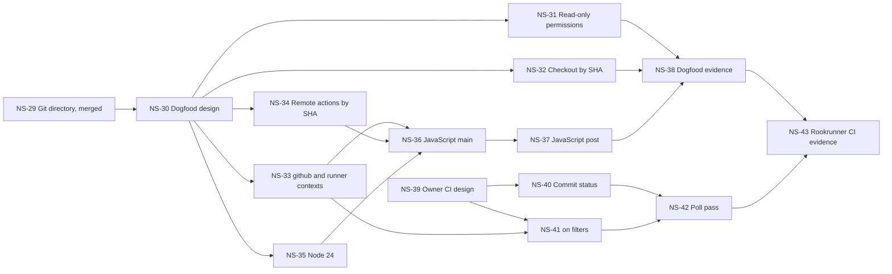

# M2 next steps

The order after NS-29 was re-prioritized on 2026-10-03. See
[Re-prioritization](#re-prioritization-2026-10-03) for what moved, why,
and what is deferred. NS-30 designs the dogfood path and does not
change the engine. NS-31 accepts read-only `permissions`. NS-32 accepts
a SHA-pinned `actions/checkout` as the owned checkout. NS-33 through
NS-43 are not started.

Status: build order, 2026-10-03. Derived from the
[PRD](../prd.md) and the [roadmap](../roadmap.md). The
[engine plan](../design/execution-engine.md) supplies the sequence inside
roadmap step 1 and the first executable subset. NS-1 through NS-19 are
implemented. NS-20 records the sanitized Git metadata allow-list, and
NS-21 copies it. NS-22 is the written design for an owned checkout of
those captured files. NS-23 accepts `uses: actions/checkout@v4` as that
checkout. It does not replace captured files, persist a credential, or
create `.git`. Other checkout inputs stay rejected. NS-24 designs a
copy of the trees and blobs of the captured base commit, and NS-25
stores those objects. The original commit object stays excluded.
NS-26 designs one synthesized commit for that tree, and NS-27 writes
it. NS-28 designs one owned `.git` directory for the attempt workspace,
and NS-29 writes it when the object store is present. NS-30 designs
the `check.yml` dogfood path. NS-31 accepts read-only `permissions`
and records the declared value. No token is created. NS-32 accepts
`uses: actions/checkout@<sha>` when `<sha>` is 40 lowercase hexadecimal
characters. The plan stores that string and sets `checkout` to
`captured`. The SHA is not fetched and is not verified. The capability
version is 11. A version 10 plan is not migrated. Filling the `github`
context is designed in NS-30 and is not started.
Continuous integration runs ruff and the
unit test suite on push and pull request. This file is not Waypoint status
and not an acceptance of open PRD questions.

Capture of working files already exists and is not repeated here. Roadmap
step 2's Git-dependent and checkout verification does not. Sanitized Git
metadata is copied to a sibling `git.json`. Credentials and remote URLs
stay excluded. An owned checkout accepts `uses: actions/checkout@v4`
and a full 40-character lowercase SHA pin. It stores that `uses`
string, does not fetch or verify the SHA, and does not replace those
files, persist a credential, or create `.git`. Other checkout inputs
stay rejected. The trees and blobs of
the captured base commit are stored beside the manifest. The original
commit object stays excluded. One synthesized commit for that tree is
stored. When the object store is present, the attempt workspace
receives an owned `.git` directory. An absent store still has no
`.git`. Read-only `permissions` are recorded and grant no token.
Filling the `github` context is designed in NS-30 and is not started.
The act pin stays historical.
Development `run.submit` stays version 0 and fixture-only. Version 1 accepts
one selected job. The CLI
submits that job and follows its status and logs. The worker runs that job
and the jobs it needs. Job containers use Docker network `bridge` by default.
`worker --network none` turns public internet access off. The job
container does not mount the Docker socket unless the worker is started
with `--docker-socket`. That flag gives the job the host Docker service.
The job keeps the caller user. The image must already contain the Docker
client. GitHub requires that service to be installed and running for
container-dependent work on a self-hosted runner
(https://docs.github.com/en/actions/how-tos/manage-runners/self-hosted-runners/monitor-and-troubleshoot#troubleshooting-containers-in-self-hosted-runners).
A job may declare service containers. The image must be digest-pinned.
GitHub allows a tag or a registry name. Each service joins a user-defined
bridge network created for that job, and its label is the hostname. The
service container does not receive the engine socket. Cancel and restart
remove the service containers and that network. `credentials`, `volumes`,
`options`, and `ports` are still rejected.

Each item is one PR. A PR does not start the next item. Existing M1 and
capture tests must still pass. Real execution checks use disposable
environments. No item publishes a GitHub Actions compatibility claim.

## First slice

**NS-1. Parse a workflow into a versioned plan, and do not run it.**

Status: implemented.

This was the first slice. It is roadmap step 1. It needs no Docker,
no protocol change, and no run record.

The PR adds one maintained YAML parser after its license and source are
recorded in [development dependency provenance](../development-dependencies.md).
The planner reads workflow bytes, including bytes taken from an existing
snapshot. It does not fetch actions, pull images, start a container, or
accept a run.

Acceptance criteria:

- One explicitly selected job with sequential `run` steps produces a
  canonical plan. The plan records a capability version, the job id, step
  order, declared shell, env, and working-directory, source locations, and a
  digest of the plan bytes. Repeating the parse yields the same digest.
- String keys such as `on` survive parsing. Duplicate YAML keys fail.
  Expression text is preserved and not evaluated.
- `secrets` and host or privileged execution fail before a plan exists.
  The error names the field and says the capability is unsupported.
  Unsupported is a current limit, not a decision to drop the feature.
  Job `needs` is NS-14. Local composite `uses` is NS-16. A job `strategy`
  matrix is NS-17. A local job `uses` of a reusable workflow is NS-18.
  A job `services` map with a digest-pinned image is NS-19. `credentials`,
  `volumes`, `options`, and `ports` on a service still fail before a plan
  exists. Remote `uses` is still rejected. An unknown `strategy` key still
  fails before a plan exists.
- A workflow with no selected job, or a job that is not sequential `run`
  steps, produces no plan.
- A workflow file larger than 500 KB produces no plan. The error is a
  capability error and cites that limit. The plan records job
  `timeout-minutes` as the job time bound, default 360 minutes, and rejects
  a value above 5 days. A step `timeout-minutes` is recorded when present.
  Its maximum is 360 minutes; a larger value is a capability error. An
  omitted step timeout is not given a default. GitHub's documented limits
  for this slice are a 500 KB workflow file, 256 matrix jobs per run, job
  execution time of 6 hours on
  hosted runners or 5 days on self-hosted runners
  (https://docs.github.com/en/actions/reference/limits), and a 360 minute
  step timeout
  (https://docs.github.com/en/actions/reference/workflows-and-actions/workflow-syntax).
- Tests cover one valid workflow and these rejections without Docker. The
  planner launches no process.

## Then, in order

**NS-2. Verify a snapshot before anything reads it as an attempt.**

Status: implemented.

Acceptance criteria:

- Verification recomputes each entry digest and the manifest digest. A
  matching snapshot is accepted. A changed byte, mode, or manifest field
  fails with no attempt directory left behind.
- The check does not follow a symlink outside the snapshot and does not read
  the original checkout.
- Tests mutate a disposable snapshot and assert rejection.

**NS-3. Materialize an attempt workspace from a verified snapshot.**

Status: implemented.

Acceptance criteria:

- The workspace is a new private directory, not the checkout and not the
  snapshot store. Regular files and internal symlink rules match the capture
  contract. Modes are the captured 0644 or 0755 modes.
- A failed materialization removes the partial workspace.
- Tests build a workspace from a captured fixture and show that editing the
  original checkout does not change the workspace bytes.

**NS-4. Run that workspace as sequential Bash steps in Docker.**

Status: implemented.

This is the library used by later worker code. It is not a protocol method.
The caller passes an image already pinned by digest. No project default
image is selected. That choice remains the open PRD question.

Omitted shell, `bash`, and `sh` follow the Linux runner commands reviewed
2026-10-02. Explicit `bash` enables pipefail. An omitted shell does not.
Workflow env is overridden by job env, then by step env. The runner then
sets `GITHUB_WORKSPACE` and `ROOKRUNNER_EVENT`. The event file is the
caller's canonical JSON, not a GitHub event delivery. The container uses
Docker network `bridge` by default, so the job can reach the public internet.
GitHub-hosted runners have that access by default
(https://docs.github.com/en/actions/concepts/runners/private-networking).
The worker flag `--network none` turns it off. The Docker socket stays
unmounted unless the worker is started with `--docker-socket`. That job
keeps the caller user and can open the engine socket. Host
credentials are not mounted. A nonzero
step fails the job. A later step runs only when its condition is true;
otherwise it is skipped and does not run. The result names the first failed
step, its exit code, and the image digest. Docker missing, an unresolvable
digest, and a workspace or snapshot that fails verification raise
`SETUP_FAILED` and are not exit 0.

Acceptance criteria:

- One job's `run` steps execute in order in one digest-identified container.
  Documented shell, env, and working-directory behavior for this subset is
  tested, not approximated.
- Exit 0 is success. A later step's nonzero exit is failure. Later steps
  whose condition is false are skipped and do not run. The result names the
  first failed step, the exit code, and the image digest.
- The event input is an explicit local value supplied by the caller. It is
  not a GitHub event delivery.
- Docker missing, a digest that will not resolve, or a workspace that fails
  verification is a setup failure. It is not stored as a step exit 0.
- Tests use a disposable environment. No socket is mounted into the
  container. Host credentials are not mounted.

**NS-5. Accept a workflow run only after capture and planning succeed.**

Status: implemented.

Version 1 `run.submit` captures, verifies, and plans one job, then commits a
queued run bound to the snapshot id and the manifest, workflow, plan, and
image digests. The image digest keeps the `sha256:` prefix recorded by
`run_job`. The same key and normalized input return that run. A changed
input conflicts. Invalid YAML, an unsupported field, and an unpinned image
create no run. Execution of the queued job is NS-6. Version 0 development
submission is unchanged. `worker.describe` advertises `workflow.job` and does
not advertise actions, needs, secrets, matrices, or services.

Acceptance criteria:

- A new submission version, beside unchanged development `run.submit`,
  captures the repository, verifies the workflow bytes, builds an NS-1 plan,
  and only then commits a queued run bound to that snapshot id, manifest
  digest, workflow digest, plan digest, and image digest.
- The same submission key and the same normalized input return the same run.
  A changed input under that key returns `IDEMPOTENCY_CONFLICT` and does not
  create a second run. Invalid YAML or an unsupported field creates no run.
- Editing the checkout after acceptance does not change the stored digests.
- Disconnect before the reply still leaves the accepted run retrievable.
  `worker.describe` advertises the new capability without claiming the
  rejected ones.

**NS-6. Execute an accepted run through the supervised runtime.**

Status: implemented.

The scheduler claims the oldest queued run. For a workflow job it stores
`running` and an attempt id before materializing the workspace or starting a
container. It runs the accepted plan with `run_job` and the accepted image
pin. Success is `succeeded` with exit code 0 and the accepted digests
unchanged. A nonzero step is `failed` with that exit code. A setup failure
is `failed`, with a null exit code and error kind `SETUP_FAILED`. Step
records are stored on the run. A workflow file larger than 500 KB is
rejected before a run exists. The job time bound recorded on the plan is
`timeout-minutes` (default 360 minutes). NS-8 stops the container at that
bound. Stdout and stderr on those records are capped
at 65536 characters. `run.logs` pages the captured step output. Closing the
client does not stop the worker or the container. A cancel that commits
while the job is still queued does not start a container. Caller cancellation
of a running container stops it. A container left by a killed worker is
reconciled on restart by NS-10. Development fixtures are unchanged.

Acceptance criteria:

- The worker creates the NS-3 workspace, records the attempt before launch,
  and runs NS-4. Success requires terminal `succeeded` and `exit_code` 0 for
  those digests. A nonzero step is `failed`. A setup failure is `failed`
  with a structured error and a null exit code.
- Per-step records are persisted. Client disconnect does not stop the
  container. Development fixtures still behave as in M1.
- One representative success fixture and one failure fixture are recorded
  with their digests, image digest, terminal state, and exit code.

**NS-7. Page step logs through `run.logs`.**

Status: implemented.

`run.logs` returns the captured output of the executed steps. Each step
contributes its stdout bytes, then its stderr bytes, in order. Pages stay
inside the existing protocol limit of 1–65536 bytes. `end_of_stream` is true
only after the run is terminal and those bytes are consumed. An empty page
while the run is active is not the end. This slice adds no separate log-size
cap.

Acceptance criteria:

- Stdout and stderr from the subset are stored and returned in bounded
  pages. `end_of_stream` is true only after the run is terminal and the
  bytes are consumed. An empty page while the run is active is not the end.
- Log retrieval does not require reading the whole output. Bytes match the
  container output for the fixture, independent of page size.

**NS-8. Enforce a timeout.**

Status: implemented.

The job time bound is `timeout-minutes` (default 360 minutes). GitHub-hosted
job execution time is 6 hours and self-hosted job execution time is 5 days
(https://docs.github.com/en/actions/reference/limits). A value above 5 days
is rejected at planning. The deadline starts when `run_job` begins and covers
setup and steps.

A step `timeout-minutes` is optional. There is no step default. The maximum
is 360 minutes
(https://docs.github.com/en/actions/reference/workflows-and-actions/workflow-syntax).
A larger step value is a capability error and creates no run. A step timeout
longer than the job timeout is accepted at planning; the job deadline still
ends the run.

When the job deadline is reached, the owned container is stopped and the run
ends `cancelled`, with a null exit code, a null error, and
`cancel_requested` false. That is not a caller `run.cancel`. A step timeout
kills that step, later steps do not run, and the run ends `failed` with a
null exit code and error kind `STEP_FAILED`. Neither ends `succeeded`.

The stop follows GitHub's cancellation grace: SIGINT, 7500 ms, SIGTERM,
2500 ms, then the container is removed
(https://docs.github.com/en/actions/reference/workflow-cancellation-reference).
The engine returns as soon as the container has stopped. It signals the
container's main process. A timed-out `docker exec` does not keep partial
stdout or stderr, so `run.logs` pages only the text captured before the
timeout. That page can be empty.

A run that finishes inside the timeout is unchanged. The bound is the
submitted `timeout-minutes`, or the recorded default of 360 when the
workflow omits it. Cancelling a queued run still does not start a container.
Cancelling a running container from `run.cancel` stops it and is specified
by NS-9. A container left by a killed worker is reconciled on restart by NS-10.

Acceptance criteria:

- A step or job timeout stops the owned container within a bounded grace
  period. The run ends `failed` or `cancelled` as specified by the timeout
  rule this PR documents. It does not end `succeeded`.
- A run that finishes inside the timeout is unchanged. The timeout value is
  the explicit submission value, not an unstated default that hides a hang.

**NS-9. Cancel owned containers.**

Status: implemented.

Cancelling a queued workflow run records `cancelled` and does not start a
container. Cancelling a running workflow run stops the owned container with
the same grace as a timeout (SIGINT, 7500 ms, SIGTERM, 2500 ms, then removal).
The container's main process is a shell that exits on SIGINT or SIGTERM, so
the grace returns as soon as the container stops. `sleep` is a child of that
shell. As PID 1 it would ignore those signals. The run is `cancelled` with
`cancel_requested` true only after that container
is gone. If it is still present, the run is `lost` with `cancel_requested`
true, error kind `WORKER_INTERRUPTED`, and cleanup `unresolved`. A new
workflow attempt is refused with `WORKER_NOT_READY` while that ownership is
unresolved, and a queued workflow job stays queued. Development fixtures still
run. `worker.describe` `ready` stays the scheduler flag. The first committed
terminal state wins against completion. The in-process refusal is in memory
and ends when the process stops. Restart removes a leftover owned container,
or keeps the attempt unresolved, as NS-10 specifies. That restart does not
use the in-process refusal to hold queued work.

Acceptance criteria:

- Cancelling a queued workflow run records `cancelled` and does not start a
  container.
- Cancelling a running attempt stops the owned container, then records
  `cancelled` only after cleanup is confirmed. If cleanup cannot be shown,
  the run is `lost` and a conflicting attempt is refused.
- The first committed terminal state wins a completion-versus-cancel race.
  Development-fixture cancellation still passes its existing tests.

**NS-10. Reconcile a restart without running the attempt twice.**

Status: implemented.

A kill during a workflow attempt leaves the run `running`. Restart marks
that attempt `lost` and does not launch it again. The same submission key
returns that run. The container name is recorded beside the attempt, outside
the workspace and outside the run record, before `docker create`. Restart
removes only that container. If it is gone, cleanup is
`confirmed_no_external_resources`. If it is still present, cleanup is
`unresolved`, `cancel_requested` is false, and the error does not include
the container name or a host path. A later attempt that would reuse that
attempt id or container name is refused. Queued workflow runs stay queued
and can start. They receive a new attempt id and a new container name.
Development fixtures still become `lost` with confirmed cleanup and no
container removal. A second worker still cannot take the state directory.
The in-process refusal from NS-9 still blocks every new workflow attempt
until that process stops.

Acceptance criteria:

- After a kill during an active workflow attempt, restart marks that attempt
  `lost`, does not launch it again, and still returns it for the original
  submission key.
- Queued workflow runs remain queued and can start after restart. A second
  worker still cannot take the same state directory.
- An unresolved lost attempt blocks a new attempt that would reuse its
  container or workspace identity.

**NS-11. Refuse new work when the disk budget is exhausted.**

Status: implemented.

The default budget is GitHub Actions cache storage, 10 GB per repository on
every plan in the storage table
(https://docs.github.com/en/actions/reference/limits). GitHub documents that
figure as 10 GB. This repository stores it as `10 * 1024 * 1024 * 1024`
bytes, the same 1024-based reading it uses for the documented 500 KB
workflow-file limit. The budget covers the state directory: the database,
snapshots, and attempt workspaces. A submission that would exceed it returns
`STORAGE_FULL`, creates no run, and does not consume the submission key. The
same key still returns a run that was already accepted. Active runs and their
evidence stay. GitHub evicts cache entries past its limit; this budget does
not. An operator can pass `--disk-budget-bytes`. The configured value is not
capped at 10 GB. SQLite reporting the database full still rolls back
acceptance without consuming the key. Runs and keys are still retained
indefinitely. Pruning is not implemented. Artifact storage is a separate
account quota and is not this budget.

Acceptance criteria:

- A configured budget covers state, snapshots, and attempt workspaces. A
  submission that would exceed it returns `STORAGE_FULL`, creates no run,
  and does not consume the submission key.
- Active runs and their evidence are not deleted to make room. The
  development backend's existing full-disk rollback test still passes.

**NS-12. Publish an artifact manifest for the subset.**

Status: implemented.

When a workflow attempt finishes, the worker lists regular files under that
attempt workspace whose bytes differ from the captured snapshot. Each entry
has an id, a workspace-relative path, a size, and a SHA-256 digest.
`run.artifacts` pages that manifest with the existing list page of 100.
`artifact.read` pages the file bytes with the existing 65536-byte log page.
A workflow run that wrote nothing returns an empty manifest. A path that
leaves the workspace is rejected. Symlinks are not followed. Development
fixtures still return `CAPABILITY_UNSUPPORTED`. The bytes stay in the attempt
workspace. GitHub's artifact storage quota depends on the plan (500 MB on
GitHub Free, 1 GB on GitHub Pro, 500 MB on GitHub Free for organizations,
2 GB on GitHub Team, and 50 GB on GitHub Enterprise Cloud) and that page
states no per-file or per-job count
(https://docs.github.com/en/actions/reference/limits). This worker does not
add a second quota, does not evict, and does not build an upload-artifact zip.

Acceptance criteria:

- Files the subset writes under the attempt workspace, and only those files,
  are listed with id, relative path, size, and digest. `run.artifacts` and
  `artifact.read` return pages of that manifest and its bytes.
- Paths outside the workspace are rejected. A run with no artifacts returns
  an empty manifest, not a capability error. Development fixtures still
  report artifacts unsupported.

**NS-13. Expression and context evaluator.**

Status: implemented.

Capability version is 2. The planner stores step `if` text and checks that
it parses. It does not evaluate it. At runtime an owned parser evaluates
that condition. Python `eval` is not used. An omitted `if` is `success()`.
An `if` that does not call `success`, `failure`, `always`, or `cancelled`
is `success()` combined with that expression. A false condition records the
step `skipped` and does not run it. A failed step does not stop a later
step whose condition is true. The first failed step remains the job failure.

Contexts available on `jobs.<job_id>.steps.if` are `github`, `needs`,
`strategy`, `matrix`, `job`, `runner`, `env`, `vars`, `steps`, and `inputs`
(https://docs.github.com/en/actions/reference/workflows-and-actions/contexts).
An unavailable context, including `secrets`, is an error. A missing property
of an available context is an empty string. `github.event` is the
caller-supplied event. Other `github` properties are not invented.
`runner.os` is `Linux` because this subset runs in a Linux container.
`strategy`, `matrix`, `vars`, and `inputs` are empty objects. `needs` is
empty until a job dependency supplies it (NS-14).
`steps.<id>.outcome` and `steps.<id>.conclusion` are `success`, `failure`,
or `skipped`. `steps.<id>.outputs` is empty until NS-15. `env` is the
workflow, job, and step env map, and `${{ }}` in those values stays literal.

Operators, types, and the functions used by this subset follow the
expression reference
(https://docs.github.com/en/actions/reference/workflows-and-actions/expressions).
`case` is that function: predicates run in order, and a branch that is not
taken is not evaluated. A property name may contain `-`, which is the
contexts reference rule for property dereference. `env.MY-VAR` is the
property `MY-VAR`. The operators table does not list arithmetic, and `-` is
not subtraction. A hosted runner that reads `env.MY-VAR` as subtraction is
not claimed. `hashFiles` is not implemented. Expressions in `run`, `env`,
and `name` stay literal. Job `if` and `needs` are NS-14. Matrix expansion
is NS-17. This is not a GitHub-equivalence claim.

Acceptance criteria:

- A dedicated evaluator implements the documented operators, types, and
  functions used by the subset. Python `eval` is not used.
- An unavailable context is an error. A missing property of an available
  context is an empty string.
- `if` on a step can skip it.

**NS-14. Job `needs` and outputs.**

Status: implemented.

Capability version is 3. The planner parses every job in the file. The
plan's `jobs` list is the selected job after each job it needs, in workflow
order. `job` is that selected job. A job the selection does not need is
omitted. A dependency that is not a job in the workflow is
`WORKFLOW_INVALID` and says the dependency is outside the selection. A
cycle, a self-need, or a duplicate need is `WORKFLOW_INVALID`. A forbidden
key on a job that is not selected still fails planning.

Those jobs run one at a time, in one container, on the one attempt
workspace, using the caller-pinned image. Parallel hosted jobs are not
claimed. GitHub gives each job a fresh machine; this subset does not. The
first job's deadline starts when `run_job` starts, so image setup counts
toward it. Each later job gets its own `timeout-minutes` when it starts. A
step timeout or a job deadline stops the container and does not start later
jobs. A caller cancel between jobs does not start later jobs, including a
job whose `if` is `cancelled()`.

A failed or skipped direct need skips a job whose `if` is omitted or does
not call a status function. `success()` is true only when every direct need
has result `success`. With no needs, that is true. `failure()` is true when
any ancestor job's result is `failure`. `always()` is true after those needs
have a result. A skipped job does not run its steps and publishes no
outputs. A job that ran evaluates its outputs at the end, including when a
step failed. The first failed step still fails the run. If every job
succeeded or was skipped, the run is `succeeded` with exit 0. There is no
skipped run state.

Job `if` contexts are `github`, `needs`, `vars`, and `inputs`, plus
`always`, `cancelled`, `success`, and `failure`
(https://docs.github.com/en/actions/reference/workflows-and-actions/contexts).
`needs.<job_id>` is a direct dependency, with `result` and `outputs`. A
missing property is an empty string. Other contexts on a job `if`, including
`secrets` and `steps`, are errors. `hashFiles` stays unavailable.

Job output expressions may use `github`, `needs`, `strategy`, `matrix`,
`job`, `runner`, `env`, `vars`, `secrets`, `steps`, and `inputs`. That table
lists no special functions for the key, and a listed function is available
only where it is named, so `success`, `failure`, `always`, `cancelled`, and
`hashFiles` are not accepted there. Ordinary functions, including `case`,
are. `steps.<id>.outputs` is filled from `GITHUB_OUTPUT` in NS-15.
`run` and `env` text stay literal.

Outputs are strings. Null is an empty string. A boolean is `true` or
`false`. An array or object is not copied. GitHub skips an output whose
value contains a registered secret. This subset has no secret store, so an
output expression that names the `secrets` context is not evaluated and that
key is omitted. A later job reads the missing property as an empty string.
This is not a scan for registered secret values.

Each job's outputs are at most 1 MB, and all outputs in a workflow run are
at most 50 MB, approximated with UTF-16
(https://docs.github.com/en/actions/reference/workflows-and-actions/workflow-syntax).
The syntax page does not define MB as 1000 or 1024. This check uses
1024-based UTF-16-LE bytes. An output that would pass either total is
omitted. A later output that still fits can be copied.

`case` matches the expression reference: predicates run in order, and a
branch that is not selected is not evaluated. `env.MY-VAR` is the property
`MY-VAR`. `-` is not subtraction. A hosted runner that tokenizes that name
as subtraction is not claimed.

This is not a GitHub-equivalence claim.

Acceptance criteria:

- A selected job includes its dependency closure. Skip and failure
  propagation match the documented rules under test.
- A dependency outside the selection fails planning.
- An output expression that reads `secrets` is not copied into the next job.

**NS-15. Environment files and workflow commands.**

Status: implemented.

Capability version is 4. The plan shape is unchanged. `GITHUB_ENV`,
`GITHUB_OUTPUT`, and `GITHUB_PATH` are per-step files on a writable mount.
The script directory stays read-only. A step that runs writes those files.
The write applies at the next step in the same job. The writing step does
not see its own env or PATH update. A failed step's files still apply, so
a later step whose `if` is true can read them. A skipped step, a step that
fails before exec, and a timed-out exec do not apply. The next job starts
with empty env, PATH prefixes, step outputs, and masks. The container and
workspace are still shared.

Env precedence for the process is workflow env, job env, earlier
`GITHUB_ENV`, then step env. `GITHUB_PATH` is prepended after that, to the
step's `PATH` when the step sets it, and otherwise to the container `PATH`.
An empty path file does not replace `PATH`. `GITHUB_WORKSPACE`,
`ROOKRUNNER_EVENT`, and the three file paths are set last and cannot be
replaced. `env` in an expression uses the same layers except the file paths
and the PATH prefix. `${{ }}` inside `run` and YAML `env` values stays
literal, including `env: SELECTED_COLOR: ${{ steps.color.outputs.SELECTED_COLOR }}`.
Read a step output with `steps.<id>.outputs` or a job output expression.

An env name matches the existing name rule. `GITHUB_*` and `RUNNER_*` are
ignored, as is `NODE_OPTIONS`. `CI` may be set. Names are case sensitive.
`ROOKRUNNER_*` is reserved here and is not a GitHub name. A line containing
`<<` is a heredoc. The body is joined with newlines and has no trailing
newline. An unclosed heredoc is not stored. A value containing NUL is not
stored. Invalid names are skipped and do not fail the step. Percent-escapes
stay literal. The workflow commands page does not specify a decoding table.
Output names follow the property rule, so `secret-number` is a name. A step
without an `id` can write `GITHUB_OUTPUT`, and nothing can retrieve it. A
missing or non-UTF-8 command file is ignored. No separate step-output byte
cap is added. Job outputs stay at the documented 1 MB and 50 MB totals.

Stdout commands use the documented `::` form. Only complete lines are
commands. `add-mask` registers the exact string and each whitespace-separated
word, and later log text in that job replaces the longest match with `***`.
The command line is not logged. A line before the command stays unmasked.
stderr is not ordered against stdout, so the whole step stderr is masked
with the masks registered while reading that step's stdout. Masks do not
cross jobs, and workspace files are not masked. The page says a masked value
cannot be set as an output, and the same page's example writes that value to
`GITHUB_OUTPUT` and reads `steps.<id>.outputs`. This subset follows the
example: the output is kept, and logs of that value in the job are masked.
A later job does not inherit the mask.

`stop-commands` uses a non-empty token. While it is stopped, command-shaped
lines stay literal. `::{token}::` resumes, compared exactly. `set-env` and
`add-path` are consumed and not applied. `debug` is dropped. This subset has
no `ACTIONS_STEP_DEBUG` secret. `notice`, `warning`, and `error` log the
message text and do not create an annotation. `group` logs its title.
`endgroup` is dropped. Logs are not collapsible. `echo` is dropped. An
unknown command, including `set-output`, stays in the log. `GITHUB_STEP_SUMMARY`,
`GITHUB_STATE`, `GITHUB_ARTIFACTS`, and action `INPUT_` / `STATE_` variables
are not set.

https://docs.github.com/en/actions/reference/workflows-and-actions/workflow-commands
https://docs.github.com/en/actions/reference/workflows-and-actions/variables
https://docs.github.com/en/actions/reference/workflows-and-actions/contexts

This is not a GitHub-equivalence claim.

Acceptance criteria:

- `GITHUB_ENV`, `GITHUB_OUTPUT`, and `GITHUB_PATH` apply to later steps in
  the same job and do not apply to the writing step.
- `add-mask` masks subsequent logs of that string. `set-env` and `add-path`
  do not change the next step.

**NS-16. Local composite actions.**

Status: implemented.

Capability version is 5. One runtime is in this PR: a local composite
action whose steps are `run` steps. The action file is `action.yml`, or
`action.yaml` when `action.yml` is absent. It is read from the snapshot
while planning, not from the network and not again at runtime. `uses` may
be `./path` or `$/path`. `$/` is the same-repository form. The snapshot is
those bytes, so a moving ref cannot change the run. The plan stores the
inner steps and a digest of the parsed action (path, name, description,
inputs, outputs, and inner steps). `run_job` executes that plan. Remote
`owner/repo@ref`, `docker://`, JavaScript `node20` and `node24`, and
Docker `runs.using: docker` stay unsupported and name the field. Nested
`uses` inside a composite stays unsupported. A symlink for the action
directory or either metadata filename is rejected and is not followed.

`name` and `description` are required. `author` and `branding` are
ignored. Inputs and outputs use the documented id rule: a letter or `_`,
then alphanumeric characters, `-`, or `_`. `required: true` does not fail
a missing input. A missing `with` value uses `default` when it is a
string, otherwise an empty string. Defaults are not evaluated. `with`
values must be strings. An unknown `with` key is invalid. A
`deprecationMessage` on an input that appears in `with` is plain text at
the start of that step's stdout. It is not a `::warning::` annotation.

Workflow `run` and YAML `env` stay literal. Composite `run` stays literal
too, including `${{ github.action_path }}` written in the script. The
script reads `$GITHUB_ACTION_PATH` or an env value. A whole-string
`${{ }}` is evaluated in composite step `env`, action output `value`, and
the calling step's `with`. Mixed text stays literal. Inside the action,
`inputs` is the resolved map, `steps` is that action's steps, and
`github.action_path` is the container path of the action directory
(`/workspace` for `./`, otherwise `/workspace/<path>`). Workflow steps
outside the action do not get `github.action_path` or `GITHUB_ACTION_PATH`.
`github.sha`, `github.actor`, and `github.token` are not invented.

Inner steps run in the same container and workspace. One protocol step is
recorded for the calling step. Inner stdout and stderr are concatenated.
Skipped inner steps add nothing. The step fails if any inner step fails.
The exit code is the first failed inner step's code. All skipped inner
steps still succeed with exit 0. Later inner steps run when their `if` is
true. Action outputs are evaluated even after an inner failure. A missing
property is an empty string. Outputs are published on the calling step id
only. Inner `GITHUB_OUTPUT` is not visible as `steps.<inner-id>` on the
workflow. Inner `GITHUB_ENV`, PATH prefixes, and masks apply to later
inner steps and later workflow steps. `INPUT_*` and `STATE_*` are not set.
`GITHUB_STEP_SUMMARY`, `GITHUB_STATE`, and `GITHUB_ARTIFACTS` are not set.

Each inner exec uses the calling step's `timeout-minutes` and the job
deadline. The step timeout is not split across inner steps. The metadata
page documents no byte cap and no nesting limit for an action file, so
this slice adds neither. Composite outputs are not given a second size
cap. Job outputs that read them still use the existing 1 MB per job and
50 MB per run, measured as 1024-based UTF-16-LE bytes. The metadata page
states the same 1 MB and 50 MB figures and says size is approximated with
UTF-16. It does not define MB.

An owned checkout accepts `uses: actions/checkout@v4` and does not
replace those files (NS-23). Other checkout `uses` strings stay
rejected. Sanitized metadata is the sibling `git.json` written by
NS-21. The design is NS-22.

https://docs.github.com/en/actions/reference/workflows-and-actions/metadata-syntax
https://docs.github.com/en/actions/reference/workflows-and-actions/workflow-syntax

This is not a GitHub-equivalence claim.

Acceptance criteria:

- A local composite action from the snapshot runs in the caller-pinned
  container. A later edit of that action file in the workspace does not
  change the planned script.
- A remote `uses`, a JavaScript action, and a Docker action produce no plan.

**NS-17. Matrix.**

Status: implemented.

Capability version is 6. A job may declare `strategy` with `fail-fast`,
`max-parallel`, and `matrix`. Any other `strategy` key fails planning and
names the field. `matrix` outside `strategy` still fails planning. The
planner expands a literal matrix. A matrix axis, `fail-fast`, or
`max-parallel` whose whole value is an expression is unsupported. This
slice does not evaluate matrix expressions.

Combinations follow the workflow syntax page. Axis order is declaration
order, and the last axis changes fastest. `exclude` is applied to that
product first. A partial match is enough to exclude a combination. `include`
is applied after `exclude`, so it can add a combination back. An include
object merges into original combinations when it does not overwrite an
original axis value. Otherwise it becomes its own combination. It does not
merge into a combination that an earlier include created. Original axis
values are not overwritten. Added values can be. Variable names are
case-insensitive. The stored property keeps the axis spelling. Expression
lookup of that property stays case-sensitive, which is this evaluator's
existing property rule. Axis values keep the parsed YAML type. The matrix
context example shows `node` as the number 16, while the context table
lists that value as a string. This slice keeps the parsed value. An exclude key that is not a matrix variable
removes nothing. That is not the Forgejo unknown-key rejection.

`fail-fast` defaults to true. After one combination fails, later
combinations of that job do not start. Their steps are not recorded.
`continue-on-error` stays unsupported, so every failed combination counts.
`max-parallel` must be a positive integer. GitHub publishes no numeric
ceiling, and this slice does not add one. The value is stored and exposed
as `strategy.max-parallel` when it was declared. Omitted, that property is
missing and reads as an empty string. This worker has one container, so
combinations run one at a time on the same attempt workspace. `max-parallel`
does not start more containers and does not drop combinations.

Each combination has its own step context, `GITHUB_ENV`, and step outputs.
The workspace is shared. Job `if` is evaluated once, before expansion, and
still sees empty `matrix` and `strategy` objects. Steps see `matrix` for
that combination and `strategy.fail-fast`, `strategy.job-index` (zero-based),
and `strategy.job-total`. A matrix job does not copy its outputs into
`needs`. One `timeout-minutes` covers every combination of that job. A
matrix that generates more than 256 jobs fails planning. Exactly 256 is
accepted. The syntax page states that maximum for GitHub-hosted and
self-hosted runners. This is not a GitHub-equivalence claim.

https://docs.github.com/en/actions/reference/workflows-and-actions/workflow-syntax
https://docs.github.com/en/actions/how-tos/writing-workflows/choosing-what-your-workflow-does/running-variations-of-jobs-in-a-workflow
https://docs.github.com/en/actions/reference/workflows-and-actions/contexts
https://docs.github.com/en/actions/reference/limits

Acceptance criteria:

- Include, exclude, fail-fast, and max-parallel are tested.
- Unsupported matrix keys fail at plan time.
- A matrix of 256 jobs is accepted. A matrix of 257 jobs is a capability
  error and cites the 256-job limit.

**NS-18. Reusable workflows.**

Status: implemented.

Capability version is 7. A job may call one local reusable workflow with
`uses: ./.github/workflows/<file>.yml` or the same path under `$/`. The
file is read from the snapshot. A subdirectory of `.github/workflows` is
invalid. A remote `owner/repo/path@ref` stays unsupported and is not
fetched. An expression in `uses` is invalid.

The called workflow must declare `workflow_call`. Its inputs require a
type of `boolean`, `number`, or `string`. `choice` is not a
`workflow_call` input type. A literal `with` value must match that type.
A whole-string `${{ }}` is checked after it is evaluated. An unknown
input is invalid. A required input that the caller omits is invalid. A
default does not satisfy `required`. An omitted optional input uses its
default, or the documented type default when no default is set: `false`,
`0`, or `""`. Those defaults are applied when the call runs.
`jobs.<job_id>.with` is the called workflow's `inputs` context. It is
not copied into environment variables. Booleans stay booleans.

https://docs.github.com/en/actions/reference/workflows-and-actions/workflow-syntax

Workflow outputs have no type. Each output's `value` must be one
expression. The contexts are `github`, `jobs`, `vars`, and `inputs`.
After the called jobs finish, that expression is evaluated and published
on the caller job as `needs.<caller>.outputs.<name>`. Inner job outputs
are not copied onto the caller directly. A value that names `secrets` is
rejected while planning.

https://docs.github.com/en/actions/reference/workflows-and-actions/contexts

A chain of more than ten workflows is a capability error. Ten is the
top-level caller plus nine called workflows, and ten is accepted. The
error cites the nesting section of the reusable-workflow how-to. More
than 50 unique called workflow files, including nested trees, is a
capability error. Fifty is accepted. The same file called twice counts
once. The caller file is not counted. The error cites the limitations
section of the reusable-workflow reference. A loop in the workflow tree
is invalid. These are the documented limits. This slice adds no other
numeric ceiling.

https://docs.github.com/en/actions/how-tos/reuse-automations/reuse-workflows#nesting-reusable-workflows
https://docs.github.com/en/actions/reference/workflows-and-actions/reusing-workflow-configurations#limitations-of-reusable-workflows

`jobs.<id>.secrets` and `secrets: inherit` are unsupported, so secrets
are not passed implicitly or by name. `on.workflow_call.secrets` is
unsupported. The called workflow does not receive `github.token` or
`secrets.GITHUB_TOKEN`. GitHub passes both. This slice does not.

Caller workflow env is not copied into the called workflow. The called
workflow's env applies to its own jobs and does not leak back. Pass
values back through workflow outputs.

https://docs.github.com/en/actions/reference/workflows-and-actions/reusing-workflow-configurations#limitations-of-reusable-workflows

The caller job may set `name`, `uses`, `with`, `needs`, and `if`.
`strategy`, `secrets`, `concurrency`, `permissions`, `cache-mode`,
`runs-on`, `steps`, `env`, `outputs`, `timeout-minutes`, and `defaults`
on that job are unsupported and name the field. GitHub allows a matrix
on a caller job. This slice does not, and it does not evaluate matrix
expressions.

The called workflow's jobs run in the same caller-pinned container and
attempt workspace, one at a time, after the caller job's `needs`. GitHub
gives each job its own runner. The caller job's `if` is evaluated before
the call. A false `if` skips the called jobs. The call fails if any
called job fails. Each called job has its own `timeout-minutes` deadline
when it starts. A caller job has no `timeout-minutes`. This is not a
GitHub-equivalence claim.

Acceptance criteria:

- `workflow_call` inputs and outputs type-check.
- Nesting over the documented limit fails with a capability error that
  cites the docs.
- Secrets are not passed implicitly.

**NS-19. Service containers.**

Status: implemented.

Capability version is 8. A concrete job may declare `services`. A caller
job may not; a job inside the called workflow may. Each service has an
`image` pinned by digest, the same pin as the job image. GitHub allows a
Docker Hub name or a registry name, including a floating tag. This engine
does not pull one. `env` is a string map. `command` replaces the image
command and is split into arguments. `entrypoint` replaces the image
entrypoint and stays one string. Expressions in those fields are not
evaluated. `credentials`, `volumes`, `options`, and `ports` are
unsupported and name the field. GitHub warns that `--network` is not
supported in service `options`. This slice does not accept `options`.

https://docs.github.com/en/actions/reference/workflows-and-actions/workflow-syntax

The service label is one hostname label. For a job that declares
services, the runner creates a user-defined bridge network and connects
the job container to it. The label is the service hostname. Containers
on that network reach each other without a published host port. The
default `bridge` network has no such DNS, so a job with no services stays
on `bridge`. `worker --network none` does not start service containers.
There is no separate numeric cap on how many services a job may declare.

The service container does not receive the engine socket, the workspace,
or privilege, including when the job was started with `--docker-socket`.
It is ready when it is running. If the image defines a health check, it
is ready when that check is healthy. If the container exits, or it is
not ready before the job's `timeout-minutes` deadline, setup fails and
steps do not run. The wait uses that deadline. There is no separate
health timeout. Services start after the job's `if` is true and stop
before the next job. Matrix combinations of one job share that start.
GitHub would give each matrix job its own services. `job.services` is
not a context, so no host port is recorded. This is not a
GitHub-equivalence claim.

Cancel stops the service containers and removes the network, then
records the run only after that cleanup finishes. Restart removes a
service container labeled for the owned job container, and the network
named from that container, along with the job container. An ownership
file that names only the job container still reconciles.

Acceptance criteria:

- Owned service containers become ready or fail setup.
- Cancellation and crash cleanup remove them.
- Service containers do not receive the engine socket.

**NS-20. Sanitized Git metadata.**

Status: designed. The allow-list is
[sanitized Git metadata](../design/git-metadata.md). This slice does not
copy that metadata and does not accept a checkout action.

The manifest stays format version 1. Its digest stays the SHA-256 of the
working-file manifest. A later PR may write a sibling `git.json` with
only `base_commit`, `dirty`, `git_object_format`, and a local
`refs/heads/` name. It may not copy credentials, remote URLs,
configuration, hooks, or objects. The sibling is not part of the manifest
digest. `actions/checkout` stays `CAPABILITY_UNSUPPORTED`. `github.sha`
and `github.token` stay uninvented. The capability version stays 8.

https://docs.github.com/en/actions/reference/workflows-and-actions/contexts
https://git-scm.com/docs/git-check-ref-format
https://github.com/actions/checkout

This is not a GitHub-equivalence claim.

Acceptance criteria:

- A written design names the metadata a later PR may copy.
- That design excludes credentials and remote URLs.
- Checkout actions remain an explicit rejection.

**NS-21. Copy sanitized Git metadata.**

Status: implemented. Capture writes `git.json` beside the manifest. The
fields are `format_version`, `base_commit`, `dirty`, `git_object_format`,
and `head`. `head` is a local `refs/heads/` name, or null for a detached
HEAD, an unborn repository, or any other ref. The manifest digest does
not include the sibling. Credentials, remote URLs, configuration, hooks,
and objects are not copied. `verify_snapshot` does not read the sibling.
The attempt workspace does not receive it. `actions/checkout` stays
`CAPABILITY_UNSUPPORTED`. The capability version stays 8.

https://docs.github.com/en/actions/reference/workflows-and-actions/contexts
https://git-scm.com/docs/git-check-ref-format
https://github.com/actions/checkout

This is not a GitHub-equivalence claim.

Acceptance criteria:

- The sibling copies only the fields the NS-20 design allows.
- Credentials and remote URLs are absent.
- A later checkout edit does not change the captured digest.
- Checkout actions remain an explicit rejection.

**NS-22. Owned checkout of captured files.**

Status: designed. The design is [checkout of captured files](../design/checkout.md).
This slice does not accept a checkout action.

The workspace already holds the captured files, including dirty bytes.
`actions/checkout` fetches and, by default, resets that work tree. The
following PR may accept only `uses: actions/checkout@v4` as an owned
step that does not replace those files, does not persist a credential,
and does not create `.git`. `clean: true`, a token, a repository, a
ref, and every other checkout input stay rejected. Other `uses` strings
stay rejected. `github.sha` and `github.token` stay uninvented. This
slice does not change the capability version.

https://github.com/actions/checkout

This is not a GitHub-equivalence claim.

Acceptance criteria:

- A written design names the one checkout `uses` string a later PR may accept.
- That design does not replace captured files or persist a credential.
- Checkout actions remain an explicit rejection.

**NS-23. Accept the owned checkout.**

Status: implemented. `uses: actions/checkout@v4` is an owned step. The
plan stores `uses` as that string and `checkout` as `captured`. The step
does not start a process, does not modify the workspace, does not create
`.git`, does not read `git.json`, and does not contact a network. It
succeeds with exit code 0. `clean: false` and `persist-credentials: false`
are accepted. An omitted key does not mean the upstream default of true.
`clean: true`, `persist-credentials: true`, and every other checkout
input fail planning and create no run. Other `uses` strings stay
rejected. `github.sha` and `github.token` stay uninvented. The capability
version is 9. The runner accepts only that version.

https://github.com/actions/checkout

This is not a GitHub-equivalence claim.

Acceptance criteria:

- A first step `uses: actions/checkout@v4` leaves a captured dirty file
  in place. A later `run` step still sees those bytes. The snapshot
  digest is unchanged.
- The same holds for `clean: false` and `persist-credentials: false`.
- Rejected checkout inputs fail planning and create no run.
- The workspace has no `.git` and no `git.json` after the step.
- A workflow of only `run` steps still runs.

**NS-24. Copy the captured base tree.**

Status: designed. The design is
[copy of the captured base tree](../design/git-objects.md). This slice
does not copy objects.

When `base_commit` names a commit, the following PR may copy that
commit's root tree and the trees and blobs reachable from it. An unborn
repository stores nothing. Commit objects, remotes, credentials, and
the `.git` directory stay excluded. An excluded path in that tree
stores no objects, and capture still succeeds. The copied blobs are
committed bytes. Captured files stay the dirty working bytes. The
capability version stays 9.

https://git-scm.com/docs/git-ls-tree
https://git-scm.com/docs/git-cat-file
https://git-scm.com/docs/git

This is not a GitHub-equivalence claim.

Acceptance criteria:

- A written design names the objects a later PR may copy.
- That design does not copy commit objects, remotes, credentials, or
  the `.git` directory.
- Synthesizing a commit, creating a `.git` directory, and filling the
  `github` context remain unstarted.

**NS-25. Store the captured base tree.**

Status: implemented. Capture stores the root tree of the commit named
by `base_commit`, and the trees and blobs reachable from it, as loose
objects beside the manifest
([copy of the captured base tree](../design/git-objects.md)). An unborn
repository stores nothing. A base tree that contains an excluded path
stores nothing, and capture still succeeds. Commit objects, remotes,
credentials, and the `.git` directory stay excluded. The copied blobs
are committed bytes. Captured files stay the dirty working bytes. The
snapshot command returns `git_objects_digest`. That digest is not part
of the manifest digest, the plan, the run record, or describe. The
capability version stays 9.

https://git-scm.com/docs/git-ls-tree
https://git-scm.com/docs/git-cat-file
https://git-scm.com/docs/git

This is not a GitHub-equivalence claim.

Acceptance criteria:

- The trees and blobs of the captured base commit are stored. The
  commit object is not stored.
- An unborn repository, and a base tree that contains an excluded path,
  store no objects. Capture still succeeds.
- A dirty file stays the working bytes. The copied blob stays the
  committed bytes.
- A non-empty alternates file fails capture and publishes nothing.
- The workspace has no `.git`, no `git.json`, and no object store.

**NS-26. Synthesize a commit for the captured tree.**

Status: designed. The design is
[synthesized commit](../design/synthesized-commit.md). This slice does
not write a commit object.

When the object store is present, the following PR may write one new
commit whose tree is the stored base tree. The name, email, timestamp,
and message are fixed. They are not read from the original commit.
The commit has no parents. An unborn repository and an excluded path
still store nothing. The original commit object stays excluded. The
capability version stays 9.

https://git-scm.com/book/en/v2/Git-Internals-Git-Objects
https://www.rfc-editor.org/rfc/rfc2606

This is not a GitHub-equivalence claim.

Acceptance criteria:

- A written design names the one commit a later PR may write.
- That commit does not copy the original author, committer, message,
  timestamp, or parents.
- Creating a `.git` directory and filling the `github` context remain
  unstarted.

**NS-27. Store the synthesized commit.**

Status: implemented. When the object store is present, capture stores
one loose commit whose tree is the stored root tree
([synthesized commit](../design/synthesized-commit.md)). The name,
email, timestamp, and message are fixed. They are not read from the
original commit. The commit has no parents. An unborn repository and
a base tree that contains an excluded path still store nothing. The
original commit object stays excluded. `base_commit` and `git.json`
stay unchanged. The synthesized id is included in
`git_objects_digest`. The capability version stays 9.

https://git-scm.com/book/en/v2/Git-Internals-Git-Objects
https://www.rfc-editor.org/rfc/rfc2606

This is not a GitHub-equivalence claim.

Acceptance criteria:

- When the store is present, one loose commit is stored. Its tree is
  the stored root tree. It has no parents. The name, email, timestamp,
  and message are the fixed values.
- That commit does not copy the original author, committer, message,
  timestamp, or parents. `base_commit` and `git.json` stay unchanged.
- An unborn repository, and a base tree that contains an excluded
  path, store no commit. Capture still succeeds.
- Creating a `.git` directory and filling the `github` context remain
  unstarted.

**NS-28. Write an owned Git directory in the attempt workspace.**

Status: designed. The design is
[owned Git directory](../design/git-directory.md). This slice does not
write a `.git` directory.

When the snapshot has an object store, the following PR may write one
`.git` in the attempt workspace. `HEAD` points at the synthesized
commit. The original `.git` is not copied. An absent store still
materializes with no `.git`. The checkout step still does not create
or delete that directory. Filling the `github` context stays
unstarted. The capability version stays 9.

https://git-scm.com/docs/gitrepository-layout
https://git-scm.com/docs/git-read-tree
https://git-scm.com/docs/git-config

This is not a GitHub-equivalence claim.

Acceptance criteria:

- A written design names the one `.git` directory a later PR may write
  in the attempt workspace.
- That directory points `HEAD` at the synthesized commit. It does not
  copy the original `.git` or the original commit.
- Filling the `github` context remains unstarted.

**NS-29. Store the owned Git directory.**

Status: implemented. When the snapshot has an object store,
`materialize_attempt` writes one `.git` in the attempt workspace
([owned Git directory](../design/git-directory.md)). `HEAD` points at
the synthesized commit. `git read-tree HEAD` fills the index and does
not change captured files. An absent store still materializes with no
`.git`. A rejected store or sibling creates no workspace. The checkout
step does not create or delete that directory. `written_files` omits
`.git`. The run's workspace check does not walk `.git`. Filling the
`github` context stays unstarted. The capability version stays 9.

https://git-scm.com/docs/gitrepository-layout
https://git-scm.com/docs/git-read-tree
https://git-scm.com/docs/git-config

This is not a GitHub-equivalence claim.

Acceptance criteria:

- When the store is present, the workspace has one `.git`. `HEAD`
  points at the synthesized commit. A dirty captured file stays a
  work-tree modification.
- An absent store materializes with no `.git`. A rejected store or
  sibling creates no workspace.
- The original `.git` and the original commit are not copied.
  `git.json` and `objects/` stay out of the workspace root.
- Filling the `github` context remains unstarted.

## After the first path

The trees and blobs of the captured base commit are copied. One
synthesized commit for that tree is stored. When the object store is
present, the attempt workspace receives an owned `.git` directory.
Filling the `github` context is designed in
[dogfood check](../design/dogfood-check.md) and is not started. A `run`
step has that directory when the store is present. None of this work is
authorized to call the result GitHub-equivalent.

M2 exit evidence is NS-6 through NS-10 plus the captured-input check in NS-5:
representative success and failure, unchanged digests after checkout edits,
no owned container left after cancel, and no silent second execution after
restart. NS-23 is that checkout. It is not required to say the
first subset runs.

## Re-prioritization, 2026-10-03

Accepted direction is the owner's 2026-10-03 priorities, in order:

1. Dogfood as soon as possible. Rookrunner runs this repository's
   `.github/workflows/check.yml` end to end from the CLI.
2. Then use Rookrunner as real CI for owner repositories. It triggers on
   push and pull request and reports pass or fail to GitHub.
3. The Git-directory work, NS-28 and NS-29, finishes first. In-flight
   work is not reordered.
4. CI stays portable. Use plain scripts and minimal GitHub-only features.
   Every limit comes from a cited GitHub limit. No Terraform.

Proposed below: the slice order, the scope of each slice, and the
recommended answers to design questions. Each design question is
settled by its design PR, not by this section. NS-29 is merged and
keeps its scope. NS-30 is that dogfood design.

### What `check.yml` needs

`check.yml` has one job, `check`. Its steps are `actions/checkout` pinned
by SHA, `astral-sh/setup-uv` pinned by SHA, and three `run` steps:
`uv sync`, ruff, and unittest. Checked against the planner and the
action metadata at those SHAs on 2026-10-03:

| Element | Today | Slice |
| --- | --- | --- |
| `permissions: contents: read` | `permissions` is not a workflow key, so planning fails | NS-31 |
| `actions/checkout@11d5960…` (v4, `runs.using: node20`) | Only the string `actions/checkout@v4` is the owned checkout | NS-32 |
| `astral-sh/setup-uv@c18668ad…` | Remote `uses` is rejected | NS-34 |
| setup-uv `runs.using: node24` with `main`, `post`, and `post-if: success()` | JavaScript actions are rejected | NS-35, NS-36, NS-37 |
| setup-uv input defaults `${{ github.workspace }}` and `${{ github.token }}` | `github` holds only `event` | NS-33, NS-36 |
| setup-uv `enable-cache: auto` ("enables caching on GitHub-hosted runners") | `RUNNER_ENVIRONMENT` is not set | NS-33 |
| `uv sync`, ruff, and unittest `run` steps | Supported. `uv` comes from setup-uv's `GITHUB_PATH` write (NS-15). Downloads use the default `bridge` network | Existing |
| `runs-on: ubuntu-latest` | Accepted. The caller pins the image by digest | Unchanged |
| `on: push` and `pull_request` | Stored, not evaluated | NS-41 (CI only) |

Owner repositories pin `actions/checkout` by SHA too. Scorecard's `ci.yml`
and the websites' `scorecard.yml` use v7.0.1. So NS-32 serves both
priorities.

### What moved and why

- **Dogfood comes right after NS-29.** It is scheduled as NS-30 through
  NS-38. That pulls a narrow subset of three existing stories into Now:
  RR-16 (resolve actions), RR-17 (checkout), and RR-18 (JavaScript
  actions). The subset is only what `check.yml` needs: full-SHA pins,
  Node 24, and `main` and `post`. Before this change those stories were
  Next, under Compatibility-2.
- **GitHub reporting moves from Later investigations into scheduled
  slices** (NS-39 through NS-43). It is scoped to the operator's own
  repositories. It uses outbound HTTPS only. There is no listener and no
  runner registration. This is neither remote execution nor service for
  unrelated customers. Those stay separate discovery milestones.
- **Rookrunner itself is the first CI target.** After NS-38 its own
  `check.yml` runs, so the trigger and reporting slices can be proven on
  this repository first. Scorecard and the websites need more workflow
  support. The NS-39 inventory measures that work, and the provisional
  list below orders it.
- **M3 and M4 move after CI-1.** MCP (RR-29), the dashboard (RR-33),
  and packaging (RR-37) are not dropped. They move from Next to Later.
- **One design PR per track.** The Git work used a separate design PR
  for each implementation PR (NS-20 through NS-29). This plan uses one
  design document per track instead: NS-30 for dogfood and NS-39 for
  CI. Each implementation slice cites a section of that document. That
  removes six design-only round trips from the dogfood path.

### Build order and dependencies

Each item is still one PR. The build order is linear because there is
one build seat. Hard dependencies:

NS-31 and NS-32 come first because they are small planner changes with
no runtime risk, and each one removes a `check.yml` rejection. NS-33
precedes the runtime work because setup-uv's input defaults read
`github.workspace`. Node (NS-35) and resolution (NS-34) precede the
runtime that uses them. `main` lands before `post`. NS-36 rejects an
action that declares `post`, so nothing runs half of an action's
lifecycle.

NS-39 is docs only and does not depend on NS-31 through NS-38. The
planner seat may draft it while those slices land. It merges after
NS-38 so that its gap inventory reflects the dogfood engine.

### Limits used

No slice below adds a numeric limit without a GitHub source. Read
2026-10-03:

| Limit | Value | Source | Used by |
| --- | --- | --- | --- |
| Self-hosted job execution time | 5 days | https://docs.github.com/en/actions/reference/limits | Existing NS-8 bound |
| Self-hosted job queue time | 24 hours | https://docs.github.com/en/actions/reference/limits | NS-42 |
| Cache storage | 10 GB per repository | https://docs.github.com/en/actions/reference/limits | Existing disk budget. NS-33 directories and the NS-34 store count against it |
| REST primary limit, unauthenticated | 60 requests per hour | https://docs.github.com/en/rest/using-the-rest-api/rate-limits-for-the-rest-api | NS-30, NS-34 |
| REST primary limit, authenticated user | 5,000 requests per hour | same | NS-42 |
| REST primary limit, GitHub App installation | 5,000 per hour minimum, 12,500 maximum outside Enterprise Cloud | same | NS-42 |
| Content-generating requests | 80 per minute and 500 per hour | same | NS-40, NS-42 |
| Commit statuses | 1,000 per SHA and context | https://docs.github.com/en/rest/commits/statuses | NS-40 |
| Creating check runs | GitHub Apps only | https://docs.github.com/en/rest/checks/runs | NS-39 |
| `paths` filter diff | 3,000 files. More than 1,000 commits, or a diff timeout, always runs | https://docs.github.com/en/actions/reference/workflows-and-actions/workflow-syntax | NS-41 |
| Pending runs in a concurrency group | 100, with `queue: max` | same | Provisional P2 |

The poll interval is the operator's schedule, not a number in code. A
poll pass follows GitHub's rate-limit response headers. It does not
assume a fixed rate.

### Deliberately deferred

- A webhook receiver. It needs an inbound listener, which the PRD
  excludes from the local worker.
- Registering as a GitHub self-hosted runner. That runs GitHub's job
  protocol, not this engine. It stays under Later investigations.
- Pull requests from forks, and any untrusted code. GitHub's secure-use
  guidance says self-hosted runners should almost never run public
  repository pull requests
  (https://docs.github.com/en/actions/reference/security/secure-use).
- Secrets, `GITHUB_TOKEN`, `write` permissions, and deploy workflows.
  These wait for a reviewed secrets design.
- The `actions/cache` and artifact HTTP services, Docker actions, `pre`
  entries, `node20` actions, tag or branch action refs, and private
  action repositories.
- macOS and Windows jobs, such as Scorecard's `check-macos`.
- Check runs, until NS-39 settles the credential. Commit statuses come
  first.
- MCP, the dashboard, and packaging (M3 and M4). They come after CI-1.
- Remote workers and hosted service discovery (RR-42 and RR-45). Their
  scope is unchanged.
- Terraform and any hosted infrastructure.

## Dogfood: run `check.yml`

**NS-30. Design the `check.yml` dogfood path.**

Status: designed. The design is
[dogfood check](../design/dogfood-check.md). This slice does not change
the engine.

The design maps each element of this repository's `check.yml` to the
slice that supports it. Settled there, so later slices do not reopen
them:

1. **`github.sha`.** `base_commit` when the capture is clean and
   `included` is empty. Otherwise unset. The synthesized commit is not
   that value. Workspace `HEAD` stays the synthesized commit.
2. **`github` properties.** Set from the plan, the attempt, or the
   caller event, as the design lists. `github.token` stays unset.
   Nothing is read from the user's Git configuration.
3. **`GITHUB_ACTIONS`.** Unset. This engine is not GitHub Actions.
4. **Runner directories.** `HOME` is `/github/home`. `RUNNER_TEMP` is
   `/github/runner-temp`. `RUNNER_TOOL_CACHE` is `/github/tool-cache`.
   They are removed with the attempt and count toward the existing
   disk budget.
5. **Fetching a SHA pin.** Git over HTTPS, with no credential. The
   REST archive endpoint is not used.
6. **Node 24.** An operator-supplied directory, mounted read-only at
   `/opt/node24`. The worker does not download Node.
7. **`node20`.** Stays rejected by name. SHA-pinned `actions/checkout`
   is the owned checkout and does not run that JavaScript.
8. **Action files.** Copied into the attempt and mounted read-write.
   The content-addressed store is not mounted into the job.

https://docs.github.com/en/actions/reference/workflows-and-actions/variables
https://docs.github.com/en/actions/reference/workflows-and-actions/events-that-trigger-workflows
https://docs.github.com/en/actions/reference/workflows-and-actions/metadata-syntax
https://docs.github.com/en/actions/reference/runners/github-hosted-runners

Acceptance criteria:

- Each `check.yml` element maps to one of NS-31 through NS-37, or to
  existing behavior.
- Each answer cites the GitHub page it follows, or is labeled an
  intentional local difference.
- No limit is added without a cited GitHub limit.
- No code changes. The capability version is unchanged.

**NS-31. Accept read-only `permissions`.**

Status: implemented. The planner accepts a read-only `permissions`
value and records it. No `GITHUB_TOKEN` is created.

`permissions` is accepted at the workflow level and on a concrete job
when its value is one of these:

- `read-all`.
- `{}`.
- A map whose keys are documented scopes and whose values are `read` or
  `none`.

`write`, `write-all`, and an unknown scope are `CAPABILITY_UNSUPPORTED`
and name the field. A job that calls a reusable workflow still rejects
`permissions`. The scopes are the list on the workflow syntax page on
2026-10-04. No `GITHUB_TOKEN` is created, so a declared read scope
grants nothing. The plan records the declared value. The capability
version is 10. A version 9 plan is not migrated.

https://docs.github.com/en/actions/reference/workflows-and-actions/workflow-syntax

This is not a GitHub-equivalence claim.

Acceptance criteria:

- `permissions: contents: read` plans and runs, at the workflow level
  and on a job.
- `write`, `write-all`, and an unknown scope fail planning, name the
  field, and create no run.
- A workflow without `permissions` plans as before.

**NS-32. Accept a SHA-pinned `actions/checkout` as the owned checkout.**

Status: implemented. `uses: actions/checkout@<sha>` is the same owned
step as `actions/checkout@v4` when `<sha>` is a full-length commit SHA
of 40 lowercase hexadecimal characters.

GitHub's secure-use guidance calls a full-length commit SHA the only
way to use an action as an immutable release. The plan stores the
`uses` string verbatim, with `checkout` set to `captured`. The step
does not fetch that commit, read its action file, or run its
JavaScript. The SHA is recorded and is not verified. The `with` policy
from NS-23 is unchanged. Short SHAs, branches, and other tags stay
rejected. The capability version is 11. A version 10 plan is not
migrated.

https://docs.github.com/en/actions/reference/security/secure-use
https://github.com/actions/checkout

This is not a GitHub-equivalence claim.

Acceptance criteria:

- The checkout step in `check.yml` plans as the owned checkout. A
  captured dirty file stays in place.
- A 39-character SHA, `@main`, and `@v5` stay rejected and create no
  run.
- `actions/checkout@v4` behaves as before.

**NS-33. Fill the `github` and `runner` contexts and the default variables.**

Status: not started. It follows the NS-30 answers.

Today the `github` context holds only `event`, plus `action_path`
inside a composite. The process gets `GITHUB_WORKSPACE`,
`ROOKRUNNER_EVENT`, and the three command files. This slice sets the
values NS-30 assigns, both as context properties and as the documented
default variables. At least these are set:

- `github.workspace` and `GITHUB_WORKSPACE`.
- `github.job` and `GITHUB_JOB`.
- `github.workflow` and `GITHUB_WORKFLOW`.
- `github.event_name` and `GITHUB_EVENT_NAME`.
- `GITHUB_EVENT_PATH`, which is the existing event file.
- `runner.os` and `RUNNER_OS`, with value `Linux`.
- `runner.arch` and `RUNNER_ARCH`, from the image platform.
- `runner.environment` and `RUNNER_ENVIRONMENT`, with value
  `self-hosted`.
- `runner.temp` and `RUNNER_TEMP`.
- `runner.tool_cache` and `RUNNER_TOOL_CACHE`.
- `HOME`.
- `CI`, with value `true`.

`GITHUB_*` and `RUNNER_*` names still cannot be overwritten. `CI` can
be, as the variables reference says.

Version 1 `run.submit` gains an optional `event_name`, with the CLI
flag `--event-name`. It is part of the normalized input, so the same
key with a different event name conflicts. When it is absent,
`github.event_name` is a missing property and `GITHUB_EVENT_NAME` is
unset. A value the event does not supply stays missing. `github.token`
stays missing. Nothing comes from host Git configuration or credentials.

The temp, tool-cache, and home directories belong to the attempt and
sit outside the workspace. They are removed with the attempt and count
toward the disk budget. They are not in the artifact manifest.

https://docs.github.com/en/actions/reference/workflows-and-actions/variables
https://docs.github.com/en/actions/reference/workflows-and-actions/contexts

This is not a GitHub-equivalence claim.

Acceptance criteria:

- A `run` step sees the default variables. An `if` reads the same
  values from the contexts.
- `GITHUB_ENV` cannot replace a `GITHUB_*` or `RUNNER_*` name. It can
  replace `CI`.
- `event_name` takes part in idempotency. When it is absent,
  `github.event_name` reads as empty.
- `github.token` reads as empty. No value comes from host Git
  configuration or credentials.
- The attempt directories are removed with the attempt and count
  toward the disk budget.

**NS-34. Resolve a remote action pinned by full commit SHA.**

Status: not started.

`uses: {owner}/{repo}@{sha}` and `{owner}/{repo}/{path}@{sha}` are the
documented forms. During submission, before acceptance, the action is
fetched by the method NS-30 selects. Only a full-length commit SHA is
accepted. A tag or branch ref is `CAPABILITY_UNSUPPORTED`, and the
message asks for a SHA pin. The action directory is stored in the
state directory under its content digest. The plan records the owner,
repository, path, commit, and that digest. A later submission reuses
the stored copy after it checks the digest. The store counts toward the
disk budget, so a fetch that would exceed the budget returns
`STORAGE_FULL`. A fetch failure returns a structured error, creates no
run, and does not consume the submission key. No credential is sent.
Private action repositories stay unsupported.

The fetched `action.yml` (or `action.yaml`) is parsed with the existing
metadata rules. A remote composite action whose steps are `run` steps
runs the same way as a local one. `node24` and `docker` stay rejected in
this slice, naming `runs.using`. Nested `uses` stays rejected. The
fetched code is workflow input recorded on each run. It is not code
imported into this repository.

https://docs.github.com/en/actions/reference/workflows-and-actions/workflow-syntax
https://docs.github.com/en/actions/reference/workflows-and-actions/metadata-syntax

This is not a GitHub-equivalence claim.

Acceptance criteria:

- A pinned remote composite action runs. The run records its commit and
  digest. Tests use a local repository in place of github.com.
- A tag ref, a short SHA, and an unreachable repository create no run
  and do not consume the key.
- A second submission does not fetch again when the stored digest
  matches. A tampered stored copy is not used.
- `node24` and `docker` actions still produce no plan.

**NS-35. Provide Node 24 to the job container.**

Status: not started.

`worker --node24 DIR` names an unpacked Node.js 24 Linux distribution
for the image architecture, as NS-30 decides. The worker records a
digest of that directory and mounts it read-only at a fixed container
path. It is not added to `PATH` for `run` steps. `worker.describe`
reports Node 24, with its digest, only when the flag is set. Each run
that uses it records the digest and the version that `node --version`
prints in the job container. Rookrunner does not download or bundle
Node in this slice. Packaging (M4) revisits bundling and notices.

Acceptance criteria:

- With the flag, the mounted `node --version` runs in the job
  container. A step cannot write to the mount.
- Without the flag, describe does not report Node 24.
- A `run` step's `PATH` is unchanged.

**NS-36. Run the `main` entry of a `node24` JavaScript action.**

Status: not started.

A resolved action (NS-34) with `runs.using: node24` and `main` runs as
one step. The NS-35 Node runs the `main` file in the job container,
with `GITHUB_WORKSPACE` as the working directory.

- **Inputs.** Each input arrives as `INPUT_<NAME>`, in upper case with
  spaces replaced by `_`, as the metadata syntax documents for
  JavaScript actions. A `with` value wins. Otherwise the input
  `default` applies. A default that is a whole-string expression is
  evaluated with the contexts NS-30 names. setup-uv uses
  `${{ github.workspace }}` and `${{ github.token }}`. `required: true`
  does not fail a missing input.
- **Files.** Outputs come from `GITHUB_OUTPUT`. The env and path files
  apply at the step boundary, as in NS-15. Values written to
  `GITHUB_STATE` are stored for that action instance, for NS-37 to use.
  Other actions cannot see them. `GITHUB_STEP_SUMMARY` is a per-step
  file. Its bytes are kept as step evidence and are not rendered.
- **Commands.** Stdout workflow commands follow NS-15. An unknown
  command, such as `add-matcher`, stays in the log.
- **Exit.** Exit 0 succeeds. A nonzero exit fails the step with that
  code. Step timeout and cancel work as they do for `run` steps.

`pre`, `pre-if`, and `node20` stay rejected by name. An action that
declares `post` is rejected until NS-37, so the engine never runs half
of an action's lifecycle. The capability version increases by one.

https://docs.github.com/en/actions/reference/workflows-and-actions/metadata-syntax
https://docs.github.com/en/actions/reference/workflows-and-actions/workflow-commands

This is not a GitHub-equivalence claim.

Acceptance criteria:

- A fixture `node24` action passes these checks:
  - It reads `INPUT_*`.
  - It resolves a default of `${{ github.workspace }}`.
  - It writes an output that a later step reads.
  - It writes a `PATH` entry that a later `run` step uses.
- A nonzero exit fails the step with that code. A later step whose `if`
  is true still runs.
- State written by one action is not visible to another action.
- `pre`, `node20`, and `post` fail planning and create no run.

**NS-37. Run JavaScript `post` entries with `post-if`.**

Status: not started.

After a job's main steps, `post` entries run in reverse order of their
`main` steps. This applies to each action whose `main` ran. `post-if`
defaults to `always()` and is evaluated against the job status, as the
metadata syntax documents. setup-uv declares `post-if: success()`. The
post process receives the `STATE_<name>` values that its own `main`
wrote, and the same inputs. A post entry is recorded as its own step
after the main steps. A failed post fails the job. The first failed
main step stays the reported failure. The job deadline covers post
entries.

A caller cancel or a job deadline stops the container before post
entries run. GitHub runs the post steps of a cancelled job. That is
a documented local difference.

https://docs.github.com/en/actions/reference/workflows-and-actions/metadata-syntax

This is not a GitHub-equivalence claim.

Acceptance criteria:

- The post entries of two fixture actions run in reverse order after
  the last main step.
- `post-if: success()` skips the post after a failed step. The default,
  `always()`, runs it.
- State written in `main` reaches only that action's own post.
- A failing post fails the run. A post never turns a failed run into
  `succeeded`.

**NS-38. Dogfood: run this repository's `check.yml` from the CLI.**

Status: not started. It depends on NS-31 through NS-37.

This slice is a validation record. It adds no capability. The run uses
a clean clone of this repository at an identified commit on `main`.
The worker runs with `--node24` and the default network. The CLI
submits `--workflow .github/workflows/check.yml --job-id check
--event-name push`, a push event for that commit, and `--image` with a
digest. Then it runs `follow`.

The record is `docs/validation/dogfood-check.md` plus a JSON evidence
file, in the style of the M1 and M2 records. It names:

- The commit.
- The snapshot, manifest, workflow, and plan digests.
- The image digest.
- The Node directory digest and version.
- The setup-uv commit and action digest.
- The per-step records.
- The terminal state and exit code.
- The network the job used.
- The worker and CLI command lines.

Only `succeeded` with `exit_code` 0 for that snapshot counts as
success. A second run, on a disposable copy with a deliberate ruff
violation, must end `failed` with the ruff step's exit code. The
GitHub-hosted `check` result for the same commit is recorded as an
observed reference. It is not a dispatched comparison.

If `check.yml` exposes a gap that NS-31 through NS-37 did not cover,
this record names it. The next slice is then that gap, not NS-40.
`check.yml` itself does not change in this slice.

Acceptance criteria:

- One run of `check.yml` ends `succeeded` with exit code 0 for an
  identified commit. The record lists every digest above.
- One run ends `failed` for the ruff violation. Its exit code is
  nonzero and the record names the failing step.
- Queued, running, cancelled, lost, and unknown outcomes are not
  reported as success.

## Owner repository CI

**NS-39. Design CI for owner repositories.**

Status: not started. Docs only. The planner seat may draft it during
NS-31 through NS-38. It merges after NS-38.

A new design document, `docs/design/owner-ci.md`, settles these
questions:

1. **Trust.** Only the operator's own repositories run, and they are
   trusted code. A pull request from a fork never runs. The PRD trust
   model is unchanged.
2. **Trigger.** Recommended: a one-shot poll pass started by the OS
   scheduler (cron, launchd, or a systemd timer). It is not a resident
   service and not a listener. Webhooks need an inbound listener and
   stay deferred. Runner registration stays deferred.
3. **Source.** A dedicated clone per repository is fetched, and a clean
   work tree at the SHA is captured with no included files. GitHub runs
   `pull_request` on the merge commit, `refs/pull/<n>/merge`. Choose
   between testing that merge commit and reporting on the head SHA,
   which is GitHub's behavior, and testing the head itself. A pull
   request with a merge conflict does not run, as GitHub documents.
4. **Event payload.** Name the fields built from REST responses: `ref`,
   `before`, `after`, `repository`, and the pull request number, head,
   and base. Nothing else is invented.
5. **Reporting.** Any credential with commit-status write access can
   create a commit status. Only GitHub Apps can create check runs.
   Recommended: commit statuses first, with a context such as
   `rookrunner/<workflow>/<job>`. The state mapping follows NS-40.
6. **Credential.** This is an owner decision: a GitHub App installation
   token or a fine-grained token. The credential is read at call time
   from an operator file. It never enters the state directory, a job
   container, a snapshot, or a log. Job secrets stay disabled.
7. **Limits.** Use the table in this section. Nothing else.
8. **Coexistence.** GitHub-hosted checks keep running. Choosing required
   checks is the owner's decision.
9. **Gap inventory.** Run the planner on every push or pull-request
   workflow in Rookrunner, Scorecard, and the websites. Record each
   rejection, ranked by how many workflows it blocks. Deploy workflows
   need secrets and are out of scope.

https://docs.github.com/en/rest/commits/statuses
https://docs.github.com/en/rest/checks/runs
https://docs.github.com/en/actions/reference/workflows-and-actions/events-that-trigger-workflows
https://docs.github.com/en/actions/reference/security/secure-use

Acceptance criteria:

- Each question is answered with a cited source or labeled an
  intentional local difference. Owner decisions stay listed as open
  until they are recorded.
- The inventory lists every unsupported field for each workflow.
- There is no listener, runner registration, Terraform, or hosted
  service.
- No code changes.

**NS-40. Report a run to GitHub as a commit status.**

Status: not started. It follows NS-39.

A CLI command posts one commit status for one run. The command takes
the run, the repository, the SHA, and the context. It refuses, with a
structured error and no HTTP request, unless all of these hold:

- The run is a workflow run.
- Its snapshot is clean, with no included files.
- `base_commit` equals the SHA.

The state mapping:

| Run | Status |
| --- | --- |
| `queued` or `running` | `pending` |
| `succeeded` with `exit_code` 0 | `success` |
| `failed` | `failure` |
| `cancelled`, `lost`, or anything else | `error` |

Nothing else maps to `success`.

The credential is read at call time from the source NS-39 chose. It is
not stored, logged, or echoed in errors. The worker records each
posted state, so posting the same terminal state again sends nothing.
That keeps the run far below the 1,000 statuses allowed per SHA and
context. A rate-limit or secondary-limit response is not retried in the
same call. It returns a retryable error. The API base URL is
configurable, and its default is `https://api.github.com`. Tests use a
local HTTP stub. No test contacts GitHub.

https://docs.github.com/en/rest/commits/statuses
https://docs.github.com/en/rest/using-the-rest-api/rate-limits-for-the-rest-api

Acceptance criteria:

- A clean run at the SHA posts the mapped state. A dirty run, a run
  with included files, or a SHA mismatch posts nothing.
- Only `succeeded` with exit code 0 posts `success`.
- Posting the same terminal state again sends no request.
- The credential appears in no log, error, state file, or job
  container.

**NS-41. Evaluate `on` for push and pull request.**

Status: not started.

When `event_name` (NS-33) is `push` or `pull_request`, submission
checks `on` before acceptance:

- The event name must be listed.
- `push` checks `branches`, `branches-ignore`, `tags`, `tags-ignore`,
  `paths`, and `paths-ignore`.
- `pull_request` checks `types`, `branches`, `branches-ignore`,
  `paths`, and `paths-ignore`. The default types are `opened`,
  `synchronize`, and `reopened`.

Patterns follow the workflow syntax filter rules. The snapshot has no
history, so the caller supplies the changed-file list. When the push
has more than 1,000 commits, or the diff is unavailable, the workflow
runs. A match beyond the first 3,000 files of the diff does not count.
Both rules are documented. A workflow that does not match returns a
structured not-triggered result, creates no run, and does not consume
the key. Without `event_name`, `on` is not evaluated, as today.
`workflow_dispatch` and `schedule` are not evaluated in this slice.

https://docs.github.com/en/actions/reference/workflows-and-actions/workflow-syntax
https://docs.github.com/en/actions/reference/workflows-and-actions/events-that-trigger-workflows

This is not a GitHub-equivalence claim.

Acceptance criteria:

- Branch, tag, path, and type filters are tested for both events,
  including the ignore forms.
- A non-matching workflow creates no run and does not consume the key.
- The 1,000-commit and 3,000-file rules are tested.

**NS-42. Poll an owner repository and run its CI.**

Status: not started. It depends on NS-40 and NS-41.

A one-shot poll command handles one configured repository. The OS
scheduler starts it. Each pass:

1. Lists branch heads and open pull requests from the same repository,
   using conditional requests.
2. For each new SHA and each workflow job the operator configured,
   fetches into the dedicated clone and captures the SHA cleanly.
   Then it evaluates `on` (NS-41), submits, and posts `pending`
   (NS-40).
3. Posts the final status for each run that has become terminal.

The submission key is built from the repository, event, SHA, workflow,
and job, so a repeated pass creates no duplicate run.

A run still queued 24 hours after acceptance is cancelled and reported
as `error`. That is the self-hosted job queue time. A pass stops when
the rate-limit headers report nothing remaining, and the next pass
resumes. A pull request from a fork is skipped and recorded, never run.
Without concurrency support, an older SHA's run finishes even after a
newer push. There is no listener, no resident service, and no runner
registration.

https://docs.github.com/en/actions/reference/limits
https://docs.github.com/en/rest/using-the-rest-api/rate-limits-for-the-rest-api

Acceptance criteria:

- Against a local HTTP stub and a local Git remote:
  - A new push and a same-repository pull request each produce one run
    and one `pending`, then one final status.
  - A repeated pass creates nothing new.
  - A fork pull request runs nothing.
- The 24-hour queue rule and rate-limit exhaustion are tested.
- The credential rules from NS-40 hold.

**NS-43. Rookrunner reports its own CI.**

Status: not started. It depends on NS-38 and NS-42. It needs the owner
to authorize the credential and posting to moonbase2090/Rookrunner.

This slice is a validation record. The poll pass runs against this
repository for one push to a branch and one same-repository pull
request. The record is `docs/validation/owner-ci-rookrunner.md`. For
each SHA it lists:

- The posted context, SHA, and state.
- The run id and digests.
- The GitHub-hosted `check` result for the same SHA.

A disposable branch with a deliberate ruff violation posts `failure`.

Acceptance criteria:

- Statuses for one push and one pull request match their Rookrunner
  terminal results. Only `succeeded` with exit code 0 posted `success`.
- The forced failure posted `failure`.
- No credential appears in the record or the state directory.

### Provisional after NS-43

These items are ordered from the owner workflows read on 2026-10-03.
They get NS numbers once the NS-39 inventory is accepted, and they may
be reordered by it.

1. **P1.** Expressions in `run`, `env`, `with`, and `name`, including
   mixed text. Every owner repository uses them.
2. **P2.** `concurrency` and `cancel-in-progress` on one worker. With
   `queue: max`, at most 100 runs can be pending per group.
3. **P3.** `actions/checkout` by major tag, plus `fetch-depth: 0`.
   That one needs history in the snapshot.
4. **P4.** An owned `actions/upload-artifact` that maps to the artifact
   manifest.
5. **P5.** Check runs through a GitHub App, if NS-39 picks an App
   credential.
6. **P6.** A runner image for `ubuntu-latest` jobs that use `sudo` and
   apt. This is the PRD's runner image question.
7. **P7.** Steps that require a token, such as `write` permissions and
   `GITHUB_TOKEN`. These wait for a reviewed secrets design.
