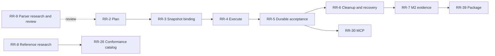

# Rookrunner delivery plan

Planning baseline: 2026-09-24. Waypoint project `rookrunner`, prefix `RR`.

## Product goal and scope

A developer or coding agent can install a local worker, submit captured source,
disconnect, and retrieve a trustworthy result with enough evidence to investigate it.
Success requires `succeeded` and `exit_code=0` for the identified input snapshot.

The owned execution engine is accepted direction. This backlog organizes delivery;
it does not accept every research proposal, establish GitHub parity, choose public
names/licenses, or authorize a hosted service. M1's development backend and M2's
source capture already have recorded validation. No real workflow execution is
implemented as of this planning baseline. Existing evidence stays in
[validation](../validation/); completed historical work is not recreated as open work.

Waypoint is authoritative for live owner/status/dependency tracking. The
[backlog manifest](backlog.json) is the planning baseline, not a live status mirror.
Waypoint currently supports `task`, not a distinct `story` type: child tasks carry
story intent and acceptance criteria in comments. Research and verification are
explicitly identified as spikes and verification work. Existing RR-1–RR-9 IDs
and history are preserved; no duplicate replacement tickets were created.

## Delivery horizons

- **Now:** RR-1 / M2. Validate and plan captured inputs, execute the initial subset,
  persist results, prove cleanup/recovery, and record end-to-end evidence.
- **Next:** semantic compatibility, action support, conformance and MCP access.
  Pull ready stories according to dependencies and user value; the whole horizon
  is not simultaneous work or a release promise.
- **Later:** advanced orchestration, dashboard and packaged preview. Refine these
  before starting; implementation acceptance remains subject to recorded evidence.
- **Discovery:** private remote execution and unrelated-customer hosting. Each has
  its own proposal and decision gate. Neither is a dependency of the local preview.

### Re-prioritization, 2026-10-03

The owner's 2026-10-03 priorities change the horizons:

- **Now:** The gap named by NS-38 is closed. A later `check.yml` run
  ended `succeeded` with exit code 0 for
  `21a3f5ad5058027fda62b2b9af6bbba9e336bf83`. NS-38's run of
  `bb634af7a211540ab54070179b7c6c873cf9c7d4` stays `failed` with exit
  code 137. NS-39 designs owner CI. The credential stays an owner
  decision. NS-40 posts one commit status. NS-41 evaluates `on` for
  push and pull request. A tag push skips the path filters. Tags under
  `pull_request` are ignored. NS-42 polls one owner repository. NS-43
  recorded those statuses. NS-44 evaluates expressions in `run`,
  `env`, `with`, and step and job `name`, including mixed text.
  NS-45 evaluates `concurrency` and `cancel-in-progress` on this one
  worker. With `queue: max`, at most 100 runs can be pending in a
  group. NS-46 designs an owned upload of workspace files and the
  CodeQL SARIF upload
  ([upload artifact](../design/upload-artifact.md)). The engine is
  unchanged. The capability version stays 12.
  A version 11 plan is not migrated. The `dogfood` epic, together with
  the `check.yml` subset of RR-16, RR-17, and RR-18, has a `succeeded`
  result with exit code 0.
- **Next:** the `ownerci` epic reports push and pull request results for
  owner repositories to GitHub as commit statuses. NS-39 designs that
  path. NS-40 posts one commit status. NS-41 evaluates `on` for push
  and pull request. NS-42 polls one owner repository. NS-43 recorded
  the statuses. NS-44 evaluates expressions in `run`, `env`, `with`,
  and step and job `name`, including mixed text. NS-45 evaluates
  `concurrency` and `cancel-in-progress` on this one worker. With
  `queue: max`, at most 100 runs can be pending in a group. NS-46
  designs an owned `actions/upload-artifact` that names files in the
  artifact manifest, and the CodeQL SARIF upload beside it
  ([upload artifact](../design/upload-artifact.md)). The engine is
  unchanged. The capability version stays 12. The implementation is
  the next slice. The rest of the provisional list in
  [next steps](next-steps.md) is not numbered yet.
- **Later:** RR-29 (MCP) moves from Next to Later, with RR-33 and RR-37.

The `dogfood` and `ownerci` stories in the [backlog manifest](backlog.json)
have no Waypoint ids yet. This planning change does not create tickets.
Their owner is `build-seat` until Waypoint assignment. The ordered slices,
rationale, and deferrals are in
[next steps](next-steps.md#re-prioritization-2026-10-03).

Milestones are outcome gates, not dates. Compatibility-1/2/3 are planning groupings,
not accepted feature tiers. M3 adapters can progress once their protocol dependencies
are ready; they need not wait for all compatibility expansion. M4 requires the local
preview's P01–P12 evidence, not completion of every advanced Actions feature.

## Working agreements

Stories describe a beneficiary and outcome, independently testable acceptance
criteria, an owner, dependencies, and rough relative size. Most are M; L means
uncertainty or scope warrants splitting before execution. Sizes are neither hours
nor delivery forecasts. No fabricated sprint velocity, due dates or percentage-done
claims. Refine using observed work, and prefer a small demonstrable slice over a
large implementation batch.

**Ready to pull:** criteria and supported/unsupported scope are understood; required
decisions and hard dependencies are resolved; the owner identifies focused tests
and evidence paths; an L story is split. Spikes have a bounded question and an
artifact/decision exit, with unresolved questions explicitly reported. Research
completion does not imply runtime acceptance.

**Work in progress:** one implementation story for codex-rr and one research/review
story for grok-rr at a time. Epics aggregate work and do not consume story capacity.
Currently RR-2 and RR-9 are in progress. grok-rr acknowledged RR-9 ownership and
start in PMUX message 4526; RR-8 follows and remains todo. Future assignments are
planning ownership, not instructions to begin every task now.

**Workflow:** todo → in_progress → review → done. Use blocked only for an actual
impediment and record its owner and next action. Future dependent stories remain
todo with `blocked_by` links; they are not all moved into the blocked status. Return
review to in_progress when findings require changes. Close abandoned work as
wontfix with a reason rather than implying delivery. These are working agreements;
Waypoint strict transition enforcement is not enabled for this project.

**Done:** acceptance criteria have evidence; meaningful focused checks pass; the
reviewed content is identified by commit SHA or content digest; contract/docs and
capability claims match implementation; review findings are resolved or explicitly
scoped out; the ticket contains result/evidence paths and remaining limitations.
Only then close it with an outcome. Epic completion requires its outcome evidence
and all required child outcomes, not just a count of closed tickets. A peer review
of documentation does not validate runtime behavior.

**Cadence:** update the active ticket when work starts, is blocked, enters review,
or produces evidence. After each delivered slice, review the demo, defects and
remaining risks and reorder the next ready work. Revisit L items before pulling
and record scope changes in tickets and this baseline when material. Build cycle
time/throughput history from completed work before forecasting dates.

**Ownership:** codex-rr owns integration and engine/runtime source. grok-rr owns
assigned research/review artifacts in `docs/research/` and `fixtures/reference/`.
Coordinate file ownership before expanding either lane. Use each agent's own
Waypoint principal. Waypoint reported Crosstalk notification failures during setup;
PMUX carries direct assignments and review findings until delivery is verified.

## Epic map

| Epic | Outcome | Horizon / milestone | Owner | Child stories |
| --- | --- | --- | --- | --- |
| RR-1 — M2: Execute captured workflows with the owned engine | A developer can execute captured local workflow inputs and trust the reported terminal result. | Now / M2 | codex-rr | RR-2, RR-3, RR-4, RR-5, RR-6, RR-7, RR-8, RR-9 |
| RR-10 — Evaluate workflow conditions and exchange step data | Authors can use conditions, contexts, step outputs and dependent jobs with explainable outcomes. | Next / Compatibility-1 | codex-rr | RR-11, RR-12, RR-13, RR-14 |
| RR-15 — Run checkout and reusable action steps | Authors can run a checkout/setup/build workflow with owned action resolution and runtimes. | Now (check.yml subset) / Compatibility-2 | codex-rr | RR-16, RR-17, RR-18, RR-19 |
| dogfood (no ticket yet) — Run this repository's check.yml end to end from the CLI | Rookrunner runs its own `check.yml` and reports a terminal result tied to an identified commit. | Now / CI-1 | build-seat | dogfooddesign, permissions, context, dogfoodproof |
| ownerci (no ticket yet) — Report CI results for owner repositories to GitHub | Pushes and same-repository pull requests on owner repositories receive a truthful commit status. | Next / CI-1 | build-seat | cidesign, status, ontriggers, poll, ciproof |
| RR-20 — Expand workflow orchestration beyond sequential builds | Teams can incrementally adopt more complex workflows without silent omissions. | Later / Compatibility-3 | codex-rr | RR-21, RR-22, RR-23, RR-24 |
| RR-25 — Make compatibility claims traceable and reproducible | Maintainers and users can see exactly which behavior is supported and how it was validated. | Next / Quality | codex-rr | RR-26, RR-27, RR-28 |
| RR-29 — Give coding agents reliable execution tools | Agents can submit, reconnect, inspect and cancel through the same contract as CLI users. | Later / M3 | codex-rr | RR-30, RR-31, RR-32 |
| RR-33 — Let humans inspect and control local execution | A developer can understand queue, results and recovery from a usable local dashboard. | Later / M3 | codex-rr | RR-34, RR-35, RR-36 |
| RR-37 — Deliver an installable local preview | A new user can install independently and complete the documented first workflow run. | Later / M4 | codex-rr | RR-38, RR-39, RR-40, RR-41 |
| RR-42 — Discover private remote execution requirements | Decide whether and how to extend local execution to authenticated private machines. | Discovery / Discovery-remote | codex-rr | RR-43, RR-44 |
| RR-45 — Discover isolation requirements for serving unrelated customers | Decide whether a managed multi-customer service is viable as a separate product milestone. | Discovery / Discovery-hosted | codex-rr | RR-46, RR-47 |

## Critical path and review checkpoints

The diagram highlights sequencing; the full ticket dependencies remain in Waypoint
and the manifest. RR-9 research can run alongside RR-2 implementation, but parser
provenance and review findings must be resolved before RR-2 closes. RR-8 research
informs later semantic stories without holding the initial restricted parser to
unimplemented parity. RR-6 is deliberately L in the baseline: split cancellation,
restart reconciliation and storage policy into reviewable stories before pulling it.

## Story acceptance criteria

### RR-1 — M2: Execute captured workflows with the owned engine

Exit: RR-7 records end-to-end success, failure, captured-input isolation, cancellation and restart evidence; all M2 stories satisfy their acceptance criteria.

**RR-2 — Parse Actions YAML and produce deterministic capability-checked plans** (enabler; codex-rr; M)

As a workflow author, I can see whether a workflow is supported before any work launches.

- Given bounded valid first-subset YAML, planning preserves on/string keys and emits the same canonical plan digest for identical inputs.
- Given duplicate keys, malformed/oversized input, unsupported fields or expressions, planning rejects with a useful source location and launches nothing.
- Validate the entire workflow; document explicit event, single Linux job, Bash, static env/defaults and sequential run-step limits.

Dependencies: none.

**RR-3 — Bind plans to verified immutable snapshots** (story; codex-rr; M)

As a developer, I can run exactly the source I submitted.

- Given a valid captured workflow, plan identity binds source/workflow digests and engine/capability versions.
- Editing the checkout after capture does not change planned bytes.
- Tampering, missing files, unsafe paths or unsupported manifest versions reject before acceptance.

Dependencies: RR-2.

**RR-4 — Implement supervised container execution for sequential Bash steps** (story; codex-rr; M)

As a developer, I can run a simple build in an identified environment.

- Given a supported plan, ordered Bash steps execute in a separate attempt workspace using a digest-identified image.
- Static environment precedence, shell/defaults and working directories have success and failure fixtures.
- No ordinary job mounts host credentials or Docker socket; step events and bounded logs identify results and resources.

Dependencies: RR-3.

**RR-5 — Persist workflow submissions and per-step results in worker protocol** (story; codex-rr; M)

As a agent client, I can disconnect and recover the same accepted run.

- Given a retried identical submission key, exactly one run binds the snapshot and plan; changed input conflicts.
- Attempt ownership persists before launch; disconnect/reconnect retains step results and evidence.
- Setup errors, workflow failure and succeeded+0 remain distinct; existing development protocol tests still pass.

Dependencies: RR-3, RR-4.

**RR-6 — Reconcile cancellation, timeouts, restart and disk budgets** (story; codex-rr; L)

As a machine owner, I can stop execution and recover without hidden work.

- Cancellation and timeout escalation confirm owned-resource termination before a definitive terminal result.
- Restart preserves queued work, never automatically repeats interrupted attempts, and blocks conflicts while cleanup is unresolved.
- Disk-budget/full-disk fixtures reject unsafe new work and preserve active evidence.

Dependencies: RR-4, RR-5.

**RR-7 — Establish M2 end-to-end execution evidence** (verification; codex-rr; M)

As a developer, I can judge the first executable release against recorded evidence.

- Public CLI fixtures cover success, nonzero failure, defaults, source isolation, cancellation and restart.
- Evidence includes exact input/code digest, image, versions, terminal state, exit code and cleanup result.
- Only succeeded+0 counts as success; local validation and GitHub reference comparison are labeled separately.

Dependencies: RR-5, RR-6.

**RR-8 — Pin runner research sources and design conformance fixtures** (spike; grok-rr; M)

As a engine implementer, I can use traceable behavior references.

- Record runner commit SHAs and primary citations for each source-derived claim.
- Fixture specifications cover contexts, outcomes, job continue-on-error, output masking, command chunks and matrix exclude ambiguity.
- Each expected result identifies documented, observed, inferred or unverified evidence; no external dispatch or upstream source import.

Dependencies: none.

**RR-9 — Review parser subset and YAML dependency provenance** (spike; grok-rr; M)

As a maintainer, I can choose a parser with understood semantics and obligations.

- Compare maintained parser options with version, provenance and license evidence.
- List scalar, duplicate-key, alias and bounded-parsing cases with expected accept/reject behavior for the proposed subset.
- Deliver contract review first; review implementation when available and report blocking findings directly with precise evidence.

Dependencies: none.

### RR-10 — Evaluate workflow conditions and exchange step data

Exit: A supported fixture suite proves each semantic feature and explicitly lists unsupported cases.

**RR-11 — Evaluate expressions in the correct workflow context** (story; codex-rr; L)

As a workflow author, I can use conditions without phase-dependent surprises.

- Own parser/evaluator handles a documented type/coercion/function subset without eval.
- Each workflow key has a context/function availability policy and evaluation phase.
- Positive, invalid-context, missing-property and type/coercion fixtures pass.

Dependencies: RR-2, RR-8.

**RR-12 — Pass environment and outputs between steps** (story; codex-rr; M)

As a workflow author, I can consume data produced by earlier steps.

- GITHUB_ENV, PATH and OUTPUT updates apply at the documented boundary; writing steps do not see later environment updates.
- UTF-8, multiline, size limits and disallowed variable updates have tests.
- Workflow command chunk boundaries and stop/resume behavior are validated; unsupported commands fail or are reported per documented policy.

Dependencies: RR-4, RR-8.

**RR-13 — Report outcomes and evaluate failure conditions accurately** (story; codex-rr; M)

As a workflow author, I can handle failed steps without a false green run.

- Persist outcome and conclusion separately around continue-on-error.
- Status functions and condition defaults have success, failure, skipped and cancellation fixtures.
- Job-level aggregation is implemented only against resolved evidence; unresolved behavior remains unsupported.

Dependencies: RR-11, RR-12.

**RR-14 — Run selected jobs with their dependency closure** (story; codex-rr; M)

As a workflow author, I can execute dependent jobs in the right order.

- needs graph validation rejects cycles and missing jobs.
- Selecting a job includes required dependencies and immutable inputs.
- Failure/skip propagation and job outputs match the declared contract with fixtures.

Dependencies: RR-13.

### RR-15 — Run checkout and reusable action steps

Exit: A pinned checkout plus setup plus build fixture completes with action provenance, lifecycle and cleanup evidence.

**RR-16 — Resolve actions to verified immutable content** (story; codex-rr; M)

As a workflow author, I can know which action code ran.

- Resolve supported action references to immutable identities and record provenance.
- Bound downloads, validate paths and metadata; reject unsupported or unsafe references.
- Cache reuse verifies content; no act fallback or upstream engine import.

Dependencies: RR-2, RR-8.

**RR-17 — Preserve submitted inputs through checkout and Git commands** (story; codex-rr; M)

As a developer, I can use checkout without replacing submitted changes.

- Define and document checkout semantics for captured dirty/untracked inputs.
- A pinned checkout fixture and Git-dependent build retain the identified snapshot contents.
- No credential-bearing local Git configuration is copied; unsupported options reject explicitly.

Dependencies: RR-16, RR-3.

**RR-18 — Execute JavaScript actions with setup and cleanup** (story; codex-rr; M)

As a workflow author, I can use supported setup actions.

- Inputs, outputs and environment follow the declared action contract in a pinned Node runtime.
- Supported pre/main/post lifecycle, reverse cleanup and failure behavior have fixtures.
- Unsupported legacy runtimes/local pre behavior reject explicitly; runtime version and licenses are recorded.

Dependencies: RR-16, RR-12.

**RR-19 — Execute local composite actions** (story; codex-rr; M)

As a workflow author, I can reuse a sequence of supported steps.

- Composite inputs and nested supported steps evaluate in the proper context without invented INPUT variables.
- Output mapping, working directories and shell requirements have fixtures.
- Bound nesting and reject unsupported action types/features before execution.

Dependencies: RR-16, RR-11, RR-12.

### RR-20 — Expand workflow orchestration beyond sequential builds

Exit: Every enabled capability has bounded-resource and failure/cleanup fixtures plus a compatibility entry.

**RR-21 — Expand and schedule bounded job matrices** (story; codex-rr; L)

As a workflow author, I can test a declared set of configurations.

- Implement include/exclude semantics against documented or observed GitHub evidence.
- Bound expansion and max-parallel; deterministic child identities are recorded.
- Fail-fast, cancellation and invalid matrix cases have fixtures.

Dependencies: RR-14.

**RR-22 — Call reusable workflows with typed inputs and outputs** (story; codex-rr; L)

As a workflow author, I can share tested workflow definitions.

- Resolve supported workflow references immutably; validate typed inputs and outputs.
- Detect recursion and bound nesting/dependency expansion.
- Unsupported secret/permission propagation rejects; call-chain evidence is retained.

Dependencies: RR-14, RR-16.

**RR-23 — Run Docker actions with owned cleanup** (story; codex-rr; M)

As a workflow author, I can use supported container actions.

- Validate metadata, args/env and image/build provenance for the declared subset.
- Persist owned resources before launch and clean them after success, failure and cancellation.
- Host socket/credential access stays excluded; lifecycle and resource-limit fixtures pass.

Dependencies: RR-16, RR-6.

**RR-24 — Run jobs with declared service containers** (story; codex-rr; M)

As a workflow author, I can test against a disposable dependency service.

- Explicit service network and port policy prevents unintended exposure.
- Readiness/timeout failures are distinguishable from job failures.
- Success, cancellation and restart leave no unaccounted owned services.

Dependencies: RR-6, RR-14.

### RR-25 — Make compatibility claims traceable and reproducible

Exit: Each advertised capability links to fixtures, source versions, local evidence and reference status.

**RR-26 — Catalog capability contracts and reference fixtures** (enabler; grok-rr; M)

As a maintainer, I can identify unsupported behavior before advertising it.

- Create a machine-readable capability/fixture manifest with version and input identities.
- Separate documented expectations, local results and observed GitHub comparisons.
- Cover initial subset and retain unresolved research cases as explicit gaps.

Dependencies: RR-8.

**RR-27 — Compare local results with reference evidence** (story; codex-rr; M)

As a maintainer, I can detect semantic regressions.

- Harness compares outcomes, outputs and ordering while ignoring incidental timestamps/log formatting.
- Mismatch fixtures prove the comparator detects false success and wrong outputs.
- External dispatch remains a separate authorized operation; missing references cannot report conformance.

Dependencies: RR-26, RR-7.

**RR-28 — Explain supported behavior and local differences** (story; grok-rr; M)

As a workflow author, I can decide whether a workflow can run here.

- Generate or verify compatibility documentation against the capability manifest.
- Unsupported syntax has actionable diagnostics and fixture links.
- Runner/image/action versions and intentional local differences accompany evidence.

Dependencies: RR-26, RR-2.

### RR-29 — Give coding agents reliable execution tools

Exit: CLI and MCP agree on identifiers, outcomes, bounded logs and errors in end-to-end fixtures.

**RR-30 — Expose execution operations through MCP** (story; codex-rr; M)

As a agent client, I can control runs without owning worker lifetime.

- MCP maps describe/submit/get/list/logs/cancel to the existing protocol.
- Disconnecting the adapter does not stop the worker or accepted work.
- CLI and MCP observe identical run identities and final results.

Dependencies: RR-5.

**RR-31 — Recover from tool errors and reconnect safely** (story; codex-rr; M)

As a agent client, I can distinguish retryable failures from run outcomes.

- Malformed calls return structured tool errors without losing the connection.
- Retry/reconnect preserves submission idempotency and cursor semantics.
- Tests distinguish unavailable worker, unsupported capability, lost run and workflow failure.

Dependencies: RR-30.

**RR-32 — Retrieve bounded logs and artifact manifests** (story; codex-rr; M)

As a agent client, I can inspect results without unbounded output or unsafe paths.

- Paginate logs and manifests with stable run-scoped cursors and byte limits.
- Artifact lookup confines paths to owned storage and reports missing/expired evidence.
- Large-output and path-traversal fixtures pass through CLI and MCP.

Dependencies: RR-30, RR-6.

### RR-33 — Let humans inspect and control local execution

Exit: Selected runnable design passes visible install-to-result, reconnect and cancellation scenarios.

**RR-34 — Compare runnable dashboard design options** (spike; codex-rr; M)

As a developer, I can choose a usable execution view before implementation.

- Provide runnable alternatives for queue, run detail and log navigation.
- Show failure, lost, disconnected and unsupported-workflow states.
- Record the selected direction before production UI implementation.

Dependencies: none.

**RR-35 — Inspect runs, steps and evidence in the dashboard** (story; codex-rr; M)

As a developer, I can understand what ran and why it failed.

- Implement the selected design using the public worker contract.
- Show snapshot identity, status, steps and bounded log/evidence access.
- Keyboard navigation, reconnect and large-output behavior have browser evidence.

Dependencies: RR-34, RR-32.

**RR-36 — Cancel work and understand recovery in the dashboard** (story; codex-rr; M)

As a machine owner, I can stop a run without confusing uncertain cleanup with success.

- Cancellation state reflects confirmed worker results.
- Lost/cleanup-pending states explain what remains uncertain and allowed next actions.
- Visible browser scenarios cover cancel races, disconnect and restart without optimistic success.

Dependencies: RR-35, RR-6.

### RR-37 — Deliver an installable local preview

Exit: P01-P12 acceptance passes from the packaged artifact and an external user completes the flow.

**RR-38 — Resolve distribution identity and third-party obligations** (enabler; grok-rr; M)

As a project owner, I can distribute an artifact with explicit naming and licensing decisions.

- Inventory runtime/bundled dependencies and their source/license/notice requirements.
- Prepare owner decisions for project license and final public identifiers.
- Record accepted decisions before distribution; ticket creation does not choose a license or authorize publication.

Dependencies: none.

**RR-39 — Build a reproducible preview archive** (story; codex-rr; M)

As a developer, I can install outside the source checkout.

- Archive includes version, checksums, dependencies and required notices for the supported platform.
- Install and uninstall work in a clean disposable environment without internal coordination services.
- Artifact build and exact digest are recorded; public publishing is a separate action.

Dependencies: RR-7, RR-38.

**RR-40 — Diagnose prerequisites and follow a documented first run** (story; codex-rr; M)

As a new user, I can resolve setup problems without inspecting implementation.

- Doctor reports versions, repository binding, Docker access and actionable missing prerequisites.
- Document install, submit, follow, inspect, cancel, upgrade and removal.
- Cold/warm startup, duration, peak memory and disk measurements are recorded without unsupported performance claims.

Dependencies: RR-39.

**RR-41 — Validate the packaged preview with an external user** (verification; codex-rr; M)

As a new user, I can complete a real build using published instructions.

- P01-P12 evidence names the exact artifact, platform, workflow input and terminal result.
- CLI, MCP and dashboard results agree; external user completes install-to-result.
- Record known limits and release decision; no publication is implied by test success.

Dependencies: RR-40, RR-31, RR-36, RR-28.

### RR-42 — Discover private remote execution requirements

Exit: A reviewed proposal identifies trust boundaries, protocol/lifecycle changes, success criteria and a go/no-go decision.

**RR-43 — Specify remote identity, transport and attempt ownership** (spike; grok-rr; M)

As a machine owner, I can understand the requirements for using a private remote worker.

- Document auth, TLS, leases, input transfer, cancellation and disconnected outcomes.
- Identify protocol changes and compatibility risks against local behavior.
- Deliver a proposal and bounded experiment plan; no remote service deployment.

Dependencies: none.

**RR-44 — Review the private remote execution proposal** (spike; codex-rr; M)

As a project owner, I can choose a separately scoped remote milestone.

- Compare proposed design against lifecycle and threat-model requirements.
- Record open risks, cost/operability questions and measurable experiment exits.
- Record keep/defer/reject direction before creating implementation commitments.

Dependencies: RR-43.

### RR-45 — Discover isolation requirements for serving unrelated customers

Exit: A reviewed proposal separates tenant isolation, service operations and economics from local/remote worker scope.

**RR-46 — Assess tenant isolation and abuse boundaries** (spike; grok-rr; M)

As a service owner, I can understand requirements before hosting untrusted customer jobs.

- Compare candidate isolation boundaries and secret/network/artifact separation.
- Identify abuse, quotas, audit and incident-response requirements.
- Document risks and experiment criteria without claiming local Docker isolation is sufficient.

Dependencies: none.

**RR-47 — Evaluate managed service viability and decision gates** (spike; codex-rr; M)

As a project owner, I can decide whether managed execution should proceed.

- Propose capacity, availability, billing and support responsibilities with assumptions.
- Document experiments needed to validate cost and isolation claims.
- Record a separate go/no-go decision; no customer serving or deployment is authorized by this backlog.

Dependencies: RR-46.

## PRD coverage and risks

| Requirement | Primary delivery stories |
| --- | --- |
| P01 installation | RR-38–RR-41 |
| P02 readiness | RR-40 |
| P03 durable submissions | RR-5, RR-30, RR-31 |
| P04 captured source | RR-3, RR-17 |
| P05 truthful results | RR-4–RR-7, RR-13 |
| P06 bounded output | RR-4, RR-32 |
| P07 cancellation | RR-6, RR-36 |
| P08 recovery | RR-5, RR-6, RR-31 |
| P09 compatibility | RR-2, RR-8, RR-9, RR-26–RR-28 |
| P10 local access | M1 existing socket evidence; RR-3, RR-4, RR-6, RR-32, RR-41 |
| P11 consistent clients | RR-30–RR-36, RR-41 |
| P12 execution evidence | RR-3–RR-7, RR-26–RR-28, RR-32 |

Key risks and responses:

- Actions semantics exceed the first release: reject unsupported behavior, expand
  through explicit fixtures, and distinguish local proof from GitHub comparisons.
- Mutable source/action/image identities undermine evidence: bind and verify them
  before execution; retain provenance with the result.
- Cleanup and crash behavior can produce false success: RR-6 is an explicit gate
  for M2 evidence and is split before implementation.
- Credentials/hosting add separate trust boundaries: initial secrets remain disabled.
  Token provisioning, OIDC, hosted permissions, cache/artifact HTTP services and
  async/background-step scheduling remain uncommitted expansion candidates. Refine
  them into stories when prioritized; do not silently add them to current stories.
- Naming/license and external-user acceptance are unresolved M4 inputs; track the
  decisions and evidence instead of inventing approval or completion.

## Planning reference

This lightweight workflow adopts ordered backlog refinement, incremental inspection
and an explicit Definition of Done from the
[Scrum Guide](https://scrumguides.org/scrum-guide.html), accessed 2026-09-24.
It does not claim a full Scrum implementation or introduce ceremonial roles/sprints.
The epic/story hierarchy, horizons and WIP limit are project-specific choices.
